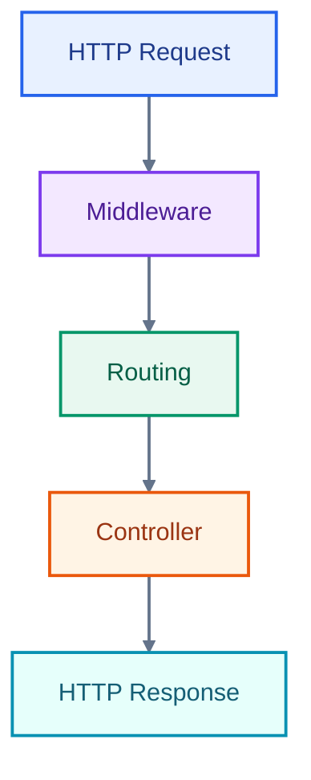
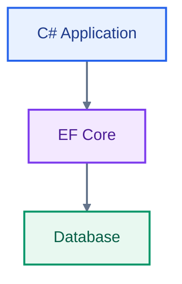

# ASP .NET Core Web API Fundamentals: Build Your First API from the Ground Up

Whether you’re coming from another programming background or you’re completely new to web APIs, this series will help you build a strong foundation in ASP .NET Core Web API.

In this first article, we’ll create a new ASP .NET Core Web API project, understand the structure Visual Studio generates for us, and learn how requests flow through the application.

We’ll start with the fundamentals before gradually moving into more advanced topics such as dependency injection, API versioning, database access, validation, authentication and authorization, background jobs, structured logging, and Web API best practices.

By the end of this article, you should understand the basic building blocks of an ASP .NET Core Web API and how they fit together.

## Prerequisites

Before we dive in, here’s what you’ll need:

- Basic knowledge of C#
- .NET SDK installed
- Visual Studio installed
- A little curiosity and patience

### GitHub Repository

You can find the complete source code used throughout the series in the [GitHub Repository](https://github.com/UlbertAO/OrgManager).

## Getting Started: Creating a New ASP .NET Core Web API

Let’s start by creating a new ASP .NET Core Web API project using Visual Studio.

**1. Open Visual Studio**
Launch Visual Studio and select **Create a new project**.

**2. Choose the Web API Template**
Search for and select **ASP .NET Core Web API**.

**3. Configure the Project**
Give your project a name and configure the project settings.

I selected:

- **Target Framework:** .NET 8.0 (LTS)
- **Authentication Type:** None
- Leave the remaining options at their default values unless your environment requires otherwise.

We’ll configure authentication ourselves later in the series so that we can understand exactly how it works.

**4. Create the Project**
Click **Create**.

Visual Studio will generate a working ASP .NET Core Web API project for you.

At first, the generated project can feel like a collection of unfamiliar files and folders. These files aren't arbitrary, though. Each one has a specific purpose and contributes to how your API is configured, started, and executed.

Understanding this structure is one of the first important steps toward becoming comfortable with ASP .NET Core.

## Understanding the Project Structure

A typical ASP .NET Core Web API project contains a solution file, a project file, configuration files, the application entry point, and one or more folders containing your API code.

Let's look at the important pieces.

### Solution and Project

A **solution** is a container for one or more related projects.

For example, as your application grows, a solution might eventually contain:

```text
OrgManager.sln
│
├── OrgManager.Api
├── OrgManager.Application
├── OrgManager.Infrastructure
└── OrgManager.Tests
```

You don't need to split your application into multiple projects immediately. A single Web API project is perfectly reasonable when you're starting out.

The important thing to understand is the distinction:

- **Solution:** Organizes one or more projects.
- **Project:** Contains the source code and configuration needed to build a particular application or library.

### Essential Files

Let's look at the files you'll encounter most often.

#### `Program.cs`

`Program.cs` is the entry point of a modern ASP .NET Core application.

It is where we configure and start the application.

Among other things, it is responsible for:

- Registering services with the dependency injection container
- Configuring the HTTP request pipeline
- Configuring middleware
- Configuring the application
- Starting the web application

A simplified `Program.cs` looks something like this:

```csharp
var builder = WebApplication.CreateBuilder(args);

// Register services
builder.Services.AddControllers();

var app = builder.Build();

// Configure the HTTP request pipeline
app.UseHttpsRedirection();

app.MapControllers();

app.Run();
```

Don't worry if some of this looks unfamiliar. We'll explore each of these concepts throughout the series.

For now, the important idea is:

> `Program.cs` is where the application is assembled and started.

#### `appsettings.json`

`appsettings.json` contains application configuration.

It's commonly used for settings such as:

- Database connection strings
- Logging configuration
- External service settings
- Application-specific configuration

For example:

```json
{
  "ConnectionStrings": {
    "DefaultConnection": "your-connection-string"
  }
}
```

ASP .NET Core also supports environment-specific configuration files.

For example:

```text
appsettings.json
appsettings.Development.json
appsettings.Production.json
```

This allows you to use different configuration values depending on the environment in which your application is running.

For example, your development environment might use a local database while production connects to a managed database server.

#### `launchSettings.json`

`launchSettings.json` is located inside the `Properties` folder.

It contains development-time launch profiles used by tools such as Visual Studio and the .NET CLI.

These profiles can define things such as:

- Application URLs
- Environment variables
- Launch configuration
- HTTPS settings

For example, when you run the application from Visual Studio, the launch profile helps determine which URL your application will use.

One important distinction is that `launchSettings.json` is primarily a **development-time configuration file**. It should not be treated as your production configuration mechanism.

### Controllers

The `Controllers` folder typically contains your API controllers.

A controller is responsible for handling HTTP requests and producing HTTP responses.

For example, an application that manages employees and departments might contain:

```text
Controllers/
├── EmployeeController.cs
└── DepartmentController.cs
```

A controller exposes endpoints such as:

```text
GET    /api/employees
GET    /api/employees/1
POST   /api/employees
PUT    /api/employees/1
DELETE /api/employees/1
```

These HTTP methods represent different operations that clients can perform against your API.

We'll explore RESTful API design and best practices in more detail later in the series.

## Dependency Injection in ASP .NET Core

ASP .NET Core has dependency injection built into the framework.

Dependency injection allows your application to provide the dependencies a class needs instead of having that class create those dependencies itself.

For example, a controller might eventually depend on a service:

```text
Controller
    ↓
Service
    ↓
Repository / DbContext
    ↓
Database
```

ASP .NET Core's built-in dependency injection container manages these dependencies for us.

You'll see service registrations in `Program.cs` such as:

```csharp
builder.Services.AddScoped<IEmployeeService, EmployeeService>();
```

And those services can then be injected into other classes.

We won't go deeply into dependency injection here because it deserves its own article later in the series.

For now, remember:

> Dependency injection is one of the core mechanisms ASP .NET Core uses to manage application dependencies.

## Configuring Services and the Request Pipeline

Two concepts you'll encounter repeatedly in ASP .NET Core are **services** and the **HTTP request pipeline**.

Understanding the difference between them will make the rest of the framework much easier to understand.

### Service Configuration

Services are application components that ASP .NET Core manages through its dependency injection container.

Examples include:

- Application services
- Entity Framework Core
- Authentication services
- Authorization services
- Logging
- HTTP clients

They are generally registered through `builder.Services` in `Program.cs`.

For example:

```csharp
builder.Services.AddControllers();
```

This tells ASP .NET Core that the application will use MVC controllers to handle HTTP requests.

### The HTTP Request Pipeline

Once a request reaches your application, it passes through a series of components called **middleware**.

You can think of middleware as a sequence of checkpoints through which every HTTP request travels.

A simplified flow looks like this:



Middleware can perform tasks such as:

- Handling exceptions
- Redirecting HTTP to HTTPS
- Authentication
- Authorization
- Logging
- Routing
- Modifying requests or responses

We'll explore middleware and the request pipeline in greater detail as the series progresses.

## Routing in ASP .NET Core Web API

Routing determines which endpoint should handle an incoming HTTP request.

For example, consider this URL:

```text
https://localhost:5001/api/products/2
```

The routing system uses the URL and HTTP method to determine which controller action should handle the request.

Here's a simple example:

```csharp
[ApiController]
[Route("api/[controller]")]
public class ProductsController : ControllerBase
{
    [HttpGet]
    public IActionResult Get()
    {
        // Logic to get all products
        return Ok();
    }

    [HttpGet("{id}")]
    public IActionResult GetById(int id)
    {
        // Logic to get a product by id
        return Ok();
    }
}
```

Let's break this down.

### `[ApiController]`

The `[ApiController]` attribute enables several API-specific behaviors, including improved model binding, automatic validation responses, and other API conventions.

We'll explore model binding and validation in a later article.

### `[Route("api/[controller]")]`

This attribute defines the base route for the controller.

The `[controller]` token is replaced by the controller name.

Therefore:

```csharp
ProductsController
```

results in:

```text
/api/products
```

### `[HttpGet]`

This tells ASP .NET Core that the action handles HTTP GET requests.

Therefore:

```text
GET /api/products
```

maps to:

```csharp
Get()
```

### `[HttpGet("{id}")]`

This defines a route parameter.

Therefore:

```text
GET /api/products/2
```

maps to:

```csharp
GetById(int id)
```

where:

```text
id = 2
```

The routing system is what connects the URL requested by the client to the code that should execute inside your application.

## Database Integration with Entity Framework Core

Most real-world Web APIs need to store and retrieve data.

Databases provide persistent storage for that data, and relational databases such as SQL Server, PostgreSQL, and MySQL use SQL to query and manipulate it.

However, writing SQL for every database operation can become repetitive when working with a C# application.

This is where **Entity Framework Core**, commonly called **EF Core**, comes in.

EF Core is an Object-Relational Mapper (ORM) for .NET.

An ORM allows us to work with database data using C# objects while EF Core handles much of the interaction with the underlying database.

You can think of EF Core as a bridge between your application's C# objects and relational database tables:



For example, instead of manually writing SQL for every operation, you can work with C# objects and LINQ:

```csharp
var employees = await dbContext.Employees
    .Where(e => e.IsActive)
    .ToListAsync();
```

EF Core translates the LINQ expression into a database query and executes it against the configured database.

We'll cover `DbContext`, database configuration, migrations, relationships, querying, and other EF Core concepts in a dedicated article later in this series.

---

At this point, you should have a basic mental model of an ASP .NET Core Web API.

A request enters the application, passes through the HTTP request pipeline, gets matched to an endpoint through routing, and eventually reaches a controller that processes the request and produces a response.

Behind the controller, your application will typically contain additional components for business logic, data access, authentication, logging, and other concerns.

As we continue through the series, we'll build these pieces one at a time rather than introducing everything at once.

The goal isn't just to learn how to make an endpoint return data.

It's to understand how the different pieces of an ASP .NET Core Web API fit together so that you can confidently build, maintain, and evolve production applications.

ASP .NET Core Web API provides a powerful foundation for building HTTP APIs with .NET.

In this first article, we created a Web API project and explored the most important building blocks:

- Solutions and projects
- `Program.cs`
- `appsettings.json`
- `launchSettings.json`
- Controllers
- Dependency injection
- The HTTP request pipeline
- Routing
- Entity Framework Core

These concepts form the foundation for everything that follows.

In the next article, we'll build on this foundation and look at **API Versioning**, including why APIs need versioning, different versioning strategies, and how to evolve an API without unexpectedly breaking existing consumers.
