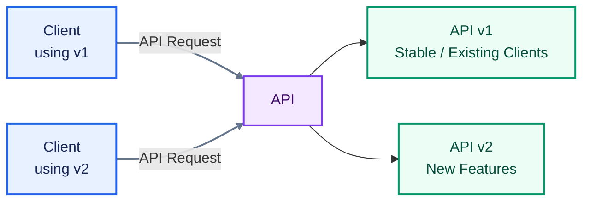
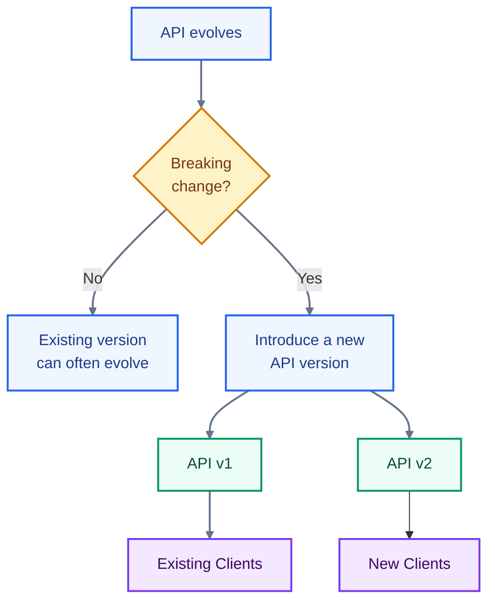
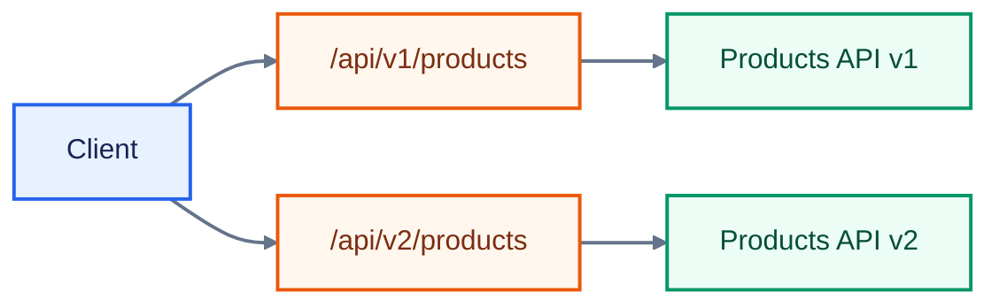
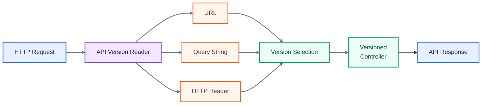
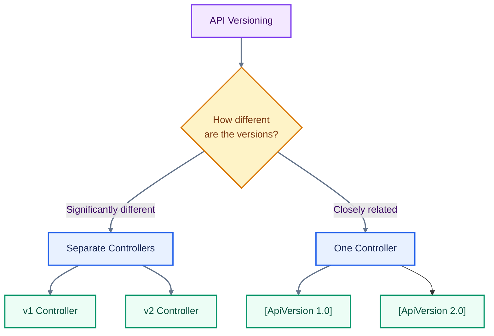
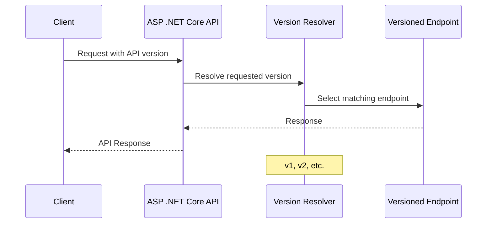
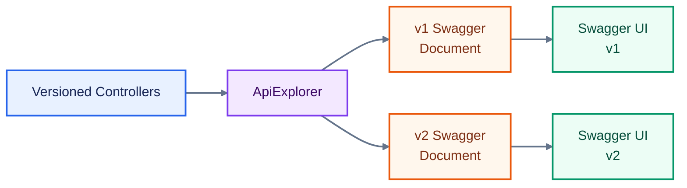
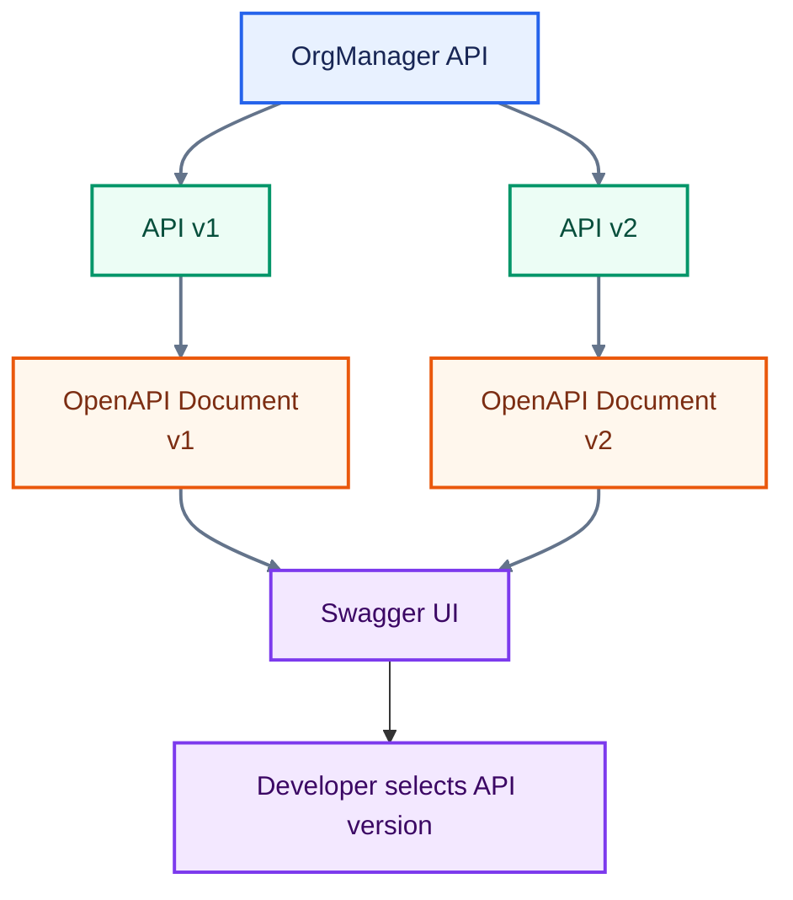
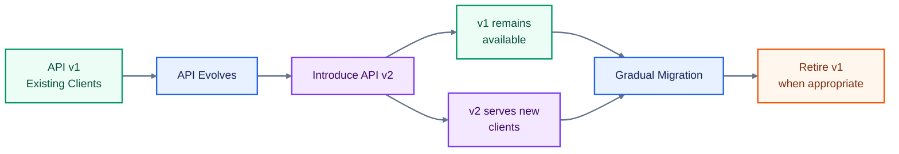

# ASP .NET Core Web API Versioning

## Prerequisites

Before we dive in, here’s what you’ll need to follow along:

- **ASP .NET Core Web API: Fundamentals**
- **GitHub Repository:** You can find all the code used throughout in this [GitHub Repository](https://github.com/UlbertAO/OrgManager).

Imagine this:

You’re in a huge city library. One day, you wander into the History section and pick up a book called _The World in 2026_. It’s clearly been read a lot. The margins are full of notes, and there are sticky tabs everywhere. You end up loving it.

A year later, the library releases a new edition: _The World in 2027_. It has updated chapters, revised statistics, and even a new section.

Now, what if the library replaced the old version entirely?

You’d lose the book you loved, your sticky notes, and your reference points.

Chaos, right?

Instead, the library keeps both versions available. Existing readers can continue using their favorite edition, while new readers can use the updated one.

Everyone wins.

That’s essentially what **API versioning** does.

It allows you to evolve an API without breaking the clients that already depend on it.



## What Is API Versioning?

When you’re building an ASP .NET Core Web API, your endpoints serve data to clients such as:

- Frontend applications
- Mobile applications
- Other APIs
- Microservices
- Third-party consumers

Over time, your API evolves.

You might add new features, change response formats, rename properties, or introduce breaking changes.

The problem is that changing an API without considering existing consumers can break applications that already depend on it.

That’s where **API versioning** comes in.

API versioning allows multiple versions of an API to exist together, so older clients can continue working while newer clients use the latest version.



### Why Use API Versioning?

API versioning provides several important benefits.

**Backward Compatibility**
Older clients can continue functioning even after the API evolves.

**Coexistence**
Multiple API versions can operate simultaneously, allowing different clients to use different versions.

**Controlled Evolution**
You can introduce new features or breaking changes without immediately disrupting existing consumers.

### Types of API Versioning

Think of API versions as different editions of the same book.

There are several ways to tell the API which edition a client wants. Three common approaches are:

1. URL-based versioning
2. Query parameter versioning
3. Header-based versioning

#### 1. URL-Based Versioning

The version number is included directly in the API endpoint URL.

Think of this as putting the version directly on the book cover.

```text
/api/v1/products
/api/v2/products
```

**Good because:**

- Clear
- Visible
- Easy to understand and discover

**Not so good:**

- URLs can become more complicated as versions increase



#### 2. Query Parameter Versioning

The version is supplied as a query parameter.

It’s like asking the librarian for a particular book and specifying which edition you want.

```text
/api/products?api-version=1.0
/api/products?api-version=2.0
```

**Good because:**

- Simple to add
- Does not require changing the route

**Not so good:**

- Clients may forget to include the version parameter

#### 3. Header-Based Versioning

The version information is sent through an HTTP header.

Think of this like scanning your library card. The system uses the information on the card to determine which edition you prefer.

```http
GET /api/products
x-version: 2.0
```

**Good because:**

- Keeps URLs clean
- Separates versioning information from the resource URL

**Not so good:**

- Less discoverable
- Requires additional client configuration

### Manual API Versioning in ASP .NET Core

You can implement API versioning yourself without using a dedicated package.

For example, you could organize controllers by version:

```text
Controllers/
├── v1/
│   └── ProductsController.cs
└── v2/
    └── ProductsController.cs
```

#### Organize Controllers by Version

Place controllers for each version in separate folders and namespaces, such as `Controllers/v1` and `Controllers/v2`.

**Version the Route**:

You can explicitly add the version to each controller route.

```csharp
[Route("api/v1/[controller]")]
public class ProductsController : ControllerBase
{
    // ...
}
```

And for version 2:

```csharp
[Route("api/v2/[controller]")]
public class ProductsController : ControllerBase
{
    // ...
}
```

This approach works, but as the number of API versions grows, maintaining everything manually becomes increasingly difficult.

**Limitations of the Manual Approach**:

- Difficult to maintain as versions increase
- Duplicate code between versions can become difficult to manage
- Advanced features, such as reporting supported versions in responses, require additional code

This is where the API versioning package becomes useful.

### API Versioning Package

Instead of reinventing the wheel, ASP .NET Core developers often use the following NuGet packages:

- **Asp.Versioning.Mvc**
- **Asp.Versioning.Mvc.ApiExplorer**: for Swagger/OpenAPI integration

These packages provide a structured way to manage API versions and integrate versioning with API documentation.

The overall flow looks like this:



### Setting Up API Versioning

Let’s walk through the setup step by step.

#### 1. Register Versioning in `Program.cs`

Add API versioning after registering your controllers:

```csharp
builder.Services.AddControllers();

var apiVersioningBuilder = builder.Services.AddApiVersioning(options =>
{
    options.AssumeDefaultVersionWhenUnspecified = true;

    options.DefaultApiVersion = new ApiVersion(1, 0);

    options.ReportApiVersions = true;

    options.ApiVersionReader = ApiVersionReader.Combine(
        new HeaderApiVersionReader("x-version") // header versioning

        // new QueryStringApiVersionReader("x-version") // query versioning
        // new UrlSegmentApiVersionReader()              // URL versioning
    );
});

apiVersioningBuilder.AddApiExplorer(options =>
{
    options.GroupNameFormat = "'v'VVV";
    options.SubstituteApiVersionInUrl = true;
});
```

This configuration:

- Sets the default API version to `1.0`
- Allows a default version to be assumed when a client doesn't specify one
- Reports supported API versions
- Configures how clients specify the API version
- Enables API Explorer integration for Swagger/OpenAPI

You can combine different version readers depending on how you want clients to specify the version.

#### 2. Tell Your Controllers Which Versions They Serve

There are two common approaches.

##### Option A: Separate Controllers for Each Version

You can place each version in its own namespace.

For example, version 1:

```csharp
namespace OrgManager.Controllers.v1
{
    [ApiVersion("1.0")]
    //[Route("api/v{version:apiVersion}/[controller]")]
    // Use this only with UrlSegmentApiVersionReader.
    // Swagger must also be configured to display the version selector.

    [Route("api/[controller]")]
    [ApiController]
    public class DepartmentController : ControllerBase
    {
        [HttpGet]
        public IActionResult Get()
        {
            return Ok();
        }
    }
}
```

And version 2:

```csharp
namespace OrgManager.Controllers.v2
{
    [ApiVersion("2.0")]
    //[Route("api/v{version:apiVersion}/[controller]")]
    // Use this only with UrlSegmentApiVersionReader.
    // Swagger must also be configured to display the version selector.

    [Route("api/[controller]")]
    [ApiController]
    public class DepartmentController : ControllerBase
    {
        [HttpGet]
        public IActionResult Get()
        {
            return Ok();
        }
    }
}
```

This approach is useful when versions have significantly different implementations.

##### Option B: One Controller, Multiple Versions

You can also keep multiple versions in the same controller.

```csharp
namespace OrgManager.Controllers
{
    [Route("api/[controller]")]
    //[Route("api/v{version:apiVersion}/[controller]")]
    // Use this only with UrlSegmentApiVersionReader.
    // Swagger must also be configured to display the version selector.

    [ApiVersion("1.0")]
    [ApiVersion("2.0")]
    [ApiController]
    public class DepartmentController : ControllerBase
    {
        [MapToApiVersion("1.0")]
        [HttpGet]
        public IActionResult Get()
        {
            return Ok();
        }

        [MapToApiVersion("2.0")]
        [HttpGet]
        public IActionResult GetAll()
        {
            return Ok();
        }
    }
}
```

This approach can be useful when the versions are closely related and only a few endpoints differ.

The decision can be visualized like this:



#### 3. Calling the API With a Version

Once versioning is configured, clients can request different versions depending on the configured `ApiVersionReader`.

For example:

**Query parameter:**

```text
/api/departments?x-version=1.0
```

**URL path:**

```text
/api/v1/departments
```

**HTTP header:**

```http
x-version: 2.0
```

The exact mechanism depends on which version reader you configure.

If a client requests a version that has not been implemented, such as `3.0`, the API returns an error indicating that the requested version is unsupported.



## Versioning and Swagger (OpenAPI)

API versioning becomes even more useful when it is reflected in your API documentation.

Swagger does not automatically understand all of the versioned API structure by itself. Without additional configuration, multiple API versions can become difficult to distinguish in Swagger UI.

For full support, configure API Explorer and Swagger to generate separate documentation for each version.

### Step 1: Add ApiExplorer in `Program.cs`

The API Explorer configuration enables version-aware API documentation:

```csharp
apiVersioningBuilder.AddApiExplorer(options =>
{
    options.GroupNameFormat = "'v'VVV";
    options.SubstituteApiVersionInUrl = true;
});
```

This creates groups such as:

```text
v1
v2
```

These groups can then be exposed as separate Swagger documents.

### Step 2: Set Up Swagger UI for Each Version

Configure Swagger UI to expose each API version:

```csharp
var versionDescriptionProvider =
    app.Services.GetRequiredService<IApiVersionDescriptionProvider>();

app.UseSwaggerUI(options =>
{
    foreach (var description in
             versionDescriptionProvider.ApiVersionDescriptions)
    {
        options.SwaggerEndpoint(
            $"/swagger/{description.GroupName}/swagger.json",
            description.GroupName.ToUpperInvariant());
    }
});
```

This allows developers to select the API version they want to explore from Swagger UI.



### Step 3: Customize Swagger Configuration

Implement a class to dynamically create documentation for each API version:

```csharp
namespace OrgManager
{
    public class ConfigureSwaggerOptions
        : IConfigureNamedOptions<SwaggerGenOptions>
    {
        private readonly IApiVersionDescriptionProvider
            apiVersionDescriptionProvider;

        public ConfigureSwaggerOptions(
            IApiVersionDescriptionProvider
                apiVersionDescriptionProvider)
        {
            this.apiVersionDescriptionProvider =
                apiVersionDescriptionProvider;
        }

        public void Configure(
            string? name,
            SwaggerGenOptions options)
        {
            Configure(options);
        }

        public void Configure(
            SwaggerGenOptions options)
        {
            foreach (var description in
                     apiVersionDescriptionProvider.ApiVersionDescriptions)
            {
                options.SwaggerDoc(
                    description.GroupName,
                    CreateVersionInfo(description));
            }
        }

        private OpenApiInfo CreateVersionInfo(
            ApiVersionDescription description)
        {
            var info = new OpenApiInfo
            {
                Title = "OrgManager API",
                Version = description.ApiVersion.ToString()
            };

            return info;
        }
    }
}
```

The result is a version-aware Swagger setup where each API version gets its own OpenAPI document.



## Putting It All Together

API versioning gives you a controlled way to evolve your API without forcing every consumer to migrate immediately.

The overall lifecycle looks like this:



The key idea is simple:

> “How will I handle the future without breaking the past?”

**API versioning is the answer.**
