# Dependency Injection in ASP .NET Core Web API

## Prerequisites

Before we dive in, here’s what you’ll need to follow along:

- API Versioning in ASP .NET Core Web API
- Basic understanding of C# classes, interfaces, and constructors

**GitHub Repository:** You can find all the code used throughout this chapter in the [GitHub Repository](https://github.com/UlbertAO/OrgManager).

Every robust application eventually has to solve a simple but important question:

> **Who creates the objects that my application needs?**

Traditionally, a class creates its own dependencies. That seems simple at first, but as the application grows, classes become tightly coupled to the objects they create.

Imagine a bakery where the cashier also bakes the bread, manages suppliers, cleans the shop, and handles customer orders.

It works for a tiny bakery.

But as the bakery grows, the cashier becomes responsible for everything.

A better approach is to give each person a specific responsibility: the baker bakes, the cashier handles customers, and the cleaner keeps the shop clean.

Dependency Injection follows the same idea in software.

Instead of a class creating the objects it depends on, those dependencies are provided to it from the outside.

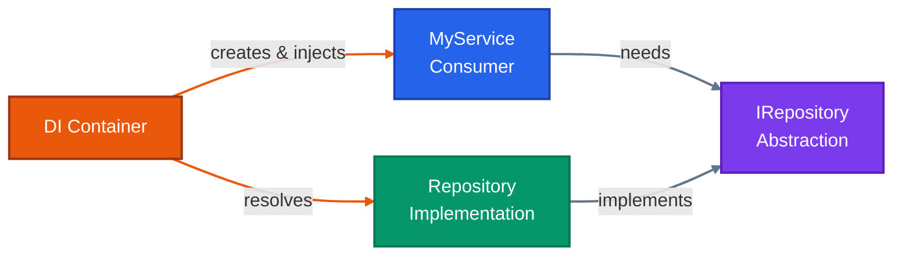

Dependency Injection (DI) is a design pattern that improves maintainability, testability, and flexibility by reducing coupling between components.

Instead of creating dependencies inside a class using the `new` keyword, dependencies are supplied from outside, typically through constructors or method parameters.

## Why Is Dependency Injection Important?

DI provides several important benefits.

**Loose Coupling:**
Classes can depend on abstractions such as interfaces rather than concrete implementations.

This makes it easier to replace an implementation without modifying the class that consumes it.

**Easier Testing:**
Dependencies can be replaced with mocks, fakes, or other test implementations during unit testing.

**Improved Maintainability:**
When the implementation of a dependency changes, the classes using that dependency generally don't need to change.

This reduces the ripple effect of changes throughout the application.

**Centralized Configuration:**
The creation and lifetime management of services can be configured in one place: the DI container.

This keeps object creation out of business logic and makes the application's dependencies easier to understand.

### Without DI: A Tightly Coupled World

Consider this example:

```csharp
public class MyService
{
    private readonly Repository _repository = new Repository();
}
```

Here, `MyService` is tightly coupled to `Repository`.

`MyService` creates its own `Repository`, which means:

- You cannot easily replace `Repository` with a mock during testing.
- Changing the repository implementation requires modifying `MyService`.
- Object creation is mixed with business logic.
- The class becomes responsible for managing its own dependency.

The dependency relationship looks like this:


The problem isn't that `Repository` exists.

The problem is that `MyService` is responsible for creating it.

### With DI: Programming Against Abstractions

With DI, `MyService` depends on an abstraction instead:

```csharp
public class MyService
{
    private readonly IRepository _repository;

    public MyService(IRepository repository)
    {
        _repository = repository;
    }
}
```

Now `MyService` doesn't know which concrete repository it will receive.

It only knows that the object provided to it implements `IRepository`.

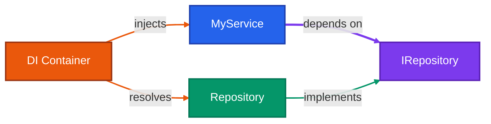

This gives us an important principle:

> **The class should focus on what it needs, not how that dependency is created.**

For example, during production, the DI container might provide a real `Repository`.

During testing, we could provide a fake or mock implementation.

### Key Components

The DI example contains three important pieces.

**Interface - `IRepository`:**
The interface defines the contract.

It describes what a repository can do without specifying how it does it.

**Implementation - `Repository`:**
The concrete class implements the `IRepository` contract.

It contains the actual repository logic.

**Consumer - `MyService`:**
`MyService` consumes the repository through the `IRepository` abstraction.

It doesn't need to know which implementation is being used.

This relationship can be visualized as:

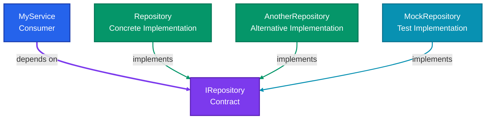

The important part is that `MyService` doesn't need to change when the implementation changes.

## DI Container in ASP .NET Core

ASP .NET Core includes a built-in Dependency Injection container.

The container is exposed through `IServiceProvider` and is responsible for resolving registered services and their dependencies.

The container handles three important responsibilities:

**Service Registration:**
You tell ASP .NET Core which implementation should be used for a particular abstraction.

This is typically configured in `Program.cs`.

**Service Lifetime:**
You tell ASP .NET Core how long each service instance should live.

For example:

- Once for the entire application
- Once per HTTP request
- A new instance every time it is requested

**Service Resolution:**
When a class requires a dependency, ASP .NET Core resolves that dependency and injects it automatically.

The overall process looks like this:

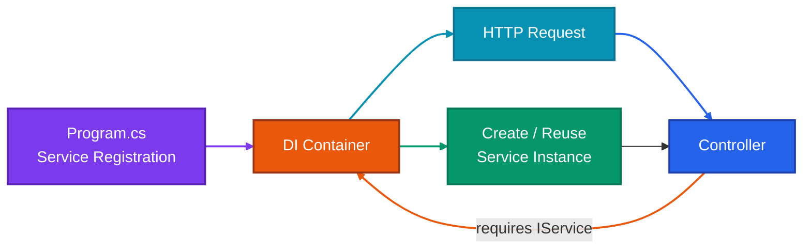

### Types of Services and Lifetimes in ASP .NET Core DI

ASP .NET Core provides three commonly used service lifetimes:

| Lifetime      | Instance creation                         | Typical use                             |
| ------------- | ----------------------------------------- | --------------------------------------- |
| **Singleton** | One instance for the application lifetime | Shared, thread-safe services and caches |
| **Scoped**    | One instance per HTTP request             | Request-specific state and `DbContext`  |
| **Transient** | A new instance every time it is requested | Lightweight, stateless services         |

The difference becomes much easier to understand visually:

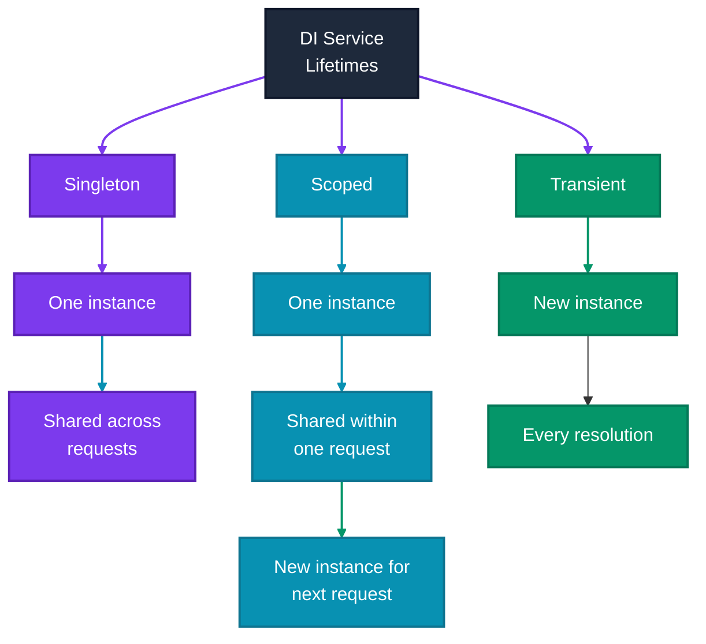

Registering the three lifetimes looks like this:

```csharp
builder.Services.AddSingleton<IMySingleton, MySingleton>();
builder.Services.AddScoped<IMyScoped, MyScoped>();
builder.Services.AddTransient<IMyTransient, MyTransient>();
```

Let's understand what each one actually means.

### Singleton - “Hire Me Once, I’ll Be Here Forever”

Imagine Saitama is the manager of your coffee shop.

You hire exactly one Saitama for the entire shop.

Every customer interacts with the same manager.

Monday? Same Saitama.

Tuesday? Same Saitama.

Customer 1? Same Saitama.

Customer 1000? Still the same Saitama.

That's the basic idea behind a Singleton.

A Singleton service has one instance for the application's lifetime.

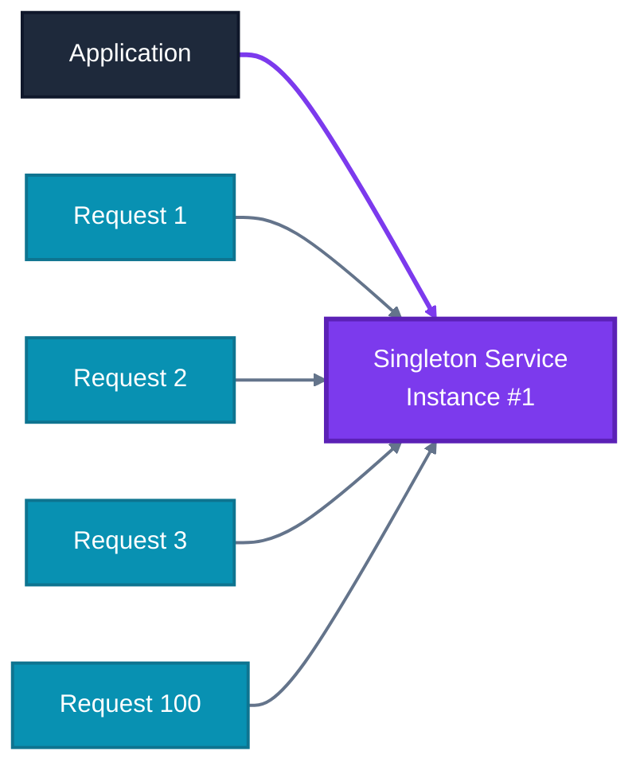

#### When Should You Use Singleton?

Use Singleton when:

- You need one shared instance.
- The service maintains application-wide state.
- The service manages a shared, expensive resource.
- The service is thread-safe.

Examples can include certain caches or application-wide services.

Be careful with stateful Singleton services. Because the same instance can be accessed concurrently by many requests, shared mutable state must be designed for concurrent access.

#### Singleton Example

Consider this service:

```csharp
public interface IService
{
    Guid GetOperationId();
}

public class MyService : IService
{
    private readonly Guid _operationId;

    public MyService()
    {
        _operationId = Guid.NewGuid();
    }

    public Guid GetOperationId() => _operationId;
}
```

Register it as a Singleton:

```csharp
builder.Services.AddSingleton<IService, MyService>();
```

Now inject it into a controller:

```csharp
[ApiController]
[Route("api/[controller]")]
public class TestController : ControllerBase
{
    private readonly IService _service;

    public TestController(IService service)
    {
        _service = service;
    }

    [HttpGet]
    public IActionResult Get()
    {
        return Ok(_service.GetOperationId());
    }
}
```

Because `MyService` is registered as Singleton, its constructor runs only once for the application.

Every request receives the same service instance.

Therefore, every call to `/api/test` returns the same GUID while that application instance is running.

Try it yourself.

### Scoped - “One Customer, One Version of Me”

Now imagine Shanks is the order taker.

Each customer gets one Shanks for their entire visit.

Customer 1 walks in:

> Shanks handles the entire order.

Customer 2 walks in:

> A new request begins, so a new Shanks handles it.

That's the idea behind a Scoped service.

A Scoped service is created once per HTTP request and reused throughout that request.

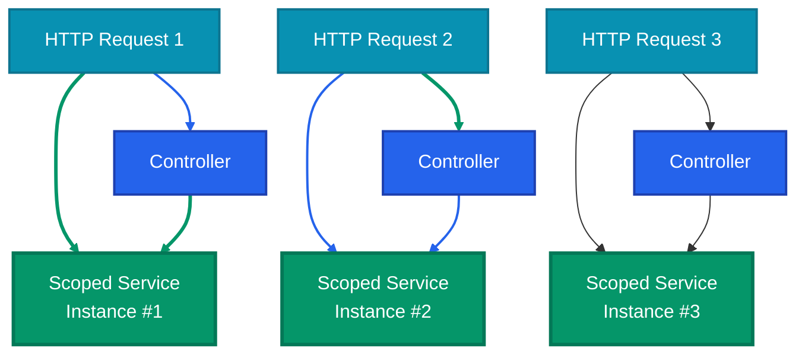

Register it with:

```csharp
builder.Services.AddScoped<IService, MyService>();
```

Now:

- The same `Guid` is returned when the service is resolved multiple times during one HTTP request.
- A new `Guid` is generated for the next HTTP request.

#### What Does “Same Instance Within One HTTP Request” Mean?

When you register a service as Scoped:

```csharp
builder.Services.AddScoped<IService, MyService>();
```

ASP .NET Core creates one instance of `MyService` for the current HTTP request.

If multiple components request `IService` during that request, the DI container returns the same instance.

When another HTTP request arrives, ASP .NET Core creates a new instance for that request.

The key idea is:

> **Scoped means one instance per request scope, not one instance per class.**

We can modify our controller to request `IService` twice:

```csharp
[ApiController]
[Route("api/[controller]")]
public class TestController : ControllerBase
{
    private readonly IService _service1;
    private readonly IService _service2;

    public TestController(IService service1, IService service2)
    {
        _service1 = service1;
        _service2 = service2;
    }

    [HttpGet]
    public IActionResult Get()
    {
        return Ok(new
        {
            First = _service1.GetOperationId(),
            Second = _service2.GetOperationId()
        });
    }
}
```

Because the service is Scoped, both dependencies resolve to the same instance within the request.

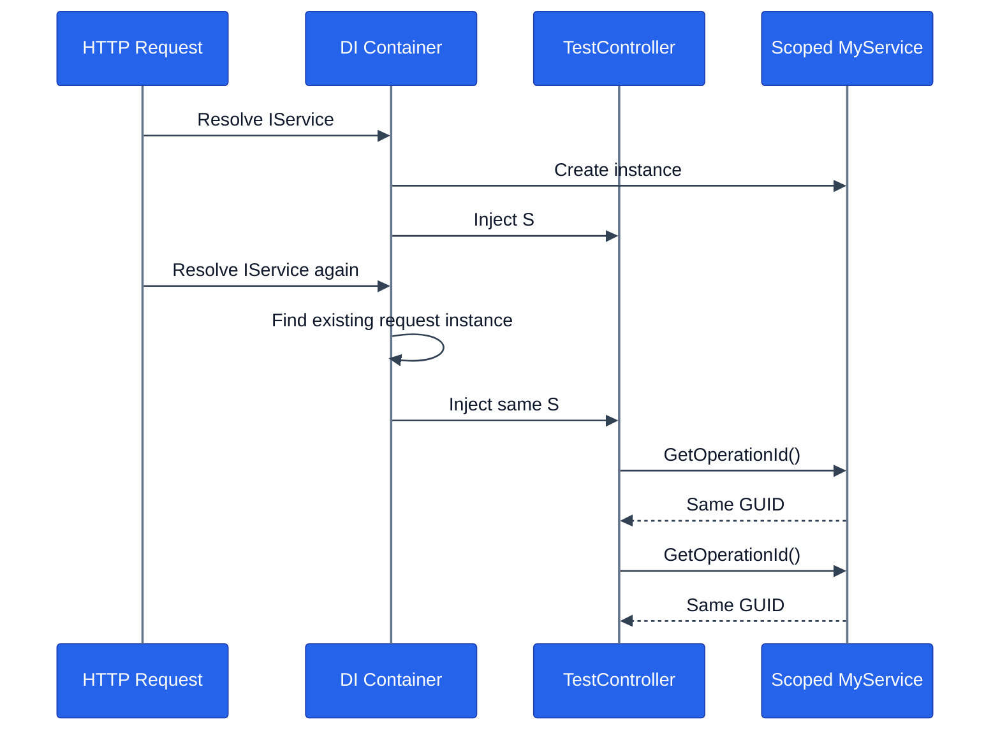

**First Request:**

```json
{
  "first": "12ab3456-789c-def0-1234-56789abcde00",
  "second": "12ab3456-789c-def0-1234-56789abcde00"
}
```

**Second Request:**

```json
{
  "first": "98de7654-3210-abcd-9876-543210fedcba",
  "second": "98de7654-3210-abcd-9876-543210fedcba"
}
```

Notice the important pattern:

- Within the first request, both values are identical.
- Within the second request, both values are identical.
- The value changes between requests.

That's Scoped lifetime in action.

#### When Is Scoped Useful?

Scoped is particularly useful when multiple components participating in the same HTTP request need to share the same instance.

A common example is Entity Framework Core's `DbContext`.

A typical Web API request might look like this:


This allows repositories participating in the same request to use the same `DbContext` instance.

That can be useful for request-level work such as coordinating database operations and maintaining a consistent unit of work.

### Transient - “Ask and I Appear!”

Now imagine Tanjiro is the cleaner.

Whenever you need him, a new Tanjiro shows up.

Need him again?

Another Tanjiro.

There is no expectation that the same instance will be reused.

That's the idea behind a Transient service.

A Transient service is created each time it is requested from the DI container.

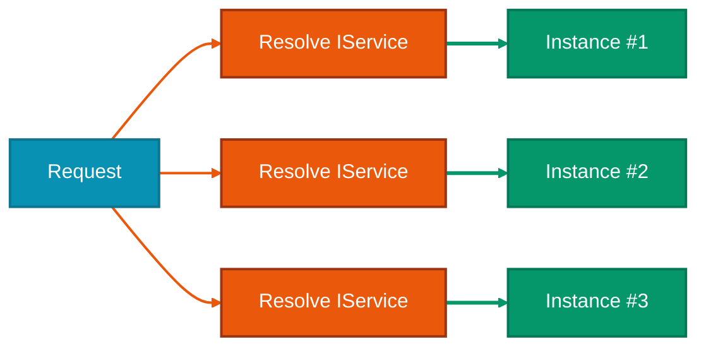

#### When Should You Use Transient?

Transient services are useful when:

- You need a fresh instance every time the service is requested.
- The service is lightweight.
- The service is stateless.
- The service doesn't need to share state with other components.

Examples include small helpers, formatters, or stateless application services.

#### Transient Example

We can reuse the previous `IService` and `MyService` classes.

Register the service as Transient:

```csharp
builder.Services.AddTransient<IService, MyService>();
```

Now consider the same controller:

```csharp
[ApiController]
[Route("api/[controller]")]
public class TestController : ControllerBase
{
    private readonly IService _service1;
    private readonly IService _service2;

    public TestController(IService service1, IService service2)
    {
        _service1 = service1;
        _service2 = service2;
    }

    [HttpGet]
    public IActionResult Get()
    {
        return Ok(new
        {
            First = _service1.GetOperationId(),
            Second = _service2.GetOperationId()
        });
    }
}
```

Because the service is Transient, each dependency resolution creates a new `MyService` instance.

The response therefore contains two different GUIDs:

```json
{
  "first": "12ab3456-789c-def0-1234-56789abcde00",
  "second": "98de7654-3210-abcd-9876-543210fedcba"
}
```

Even though both services were requested during the same HTTP request, they are different instances.

### Singleton vs Scoped vs Transient

At this point, the three lifetimes can be summarized with one simple mental model:

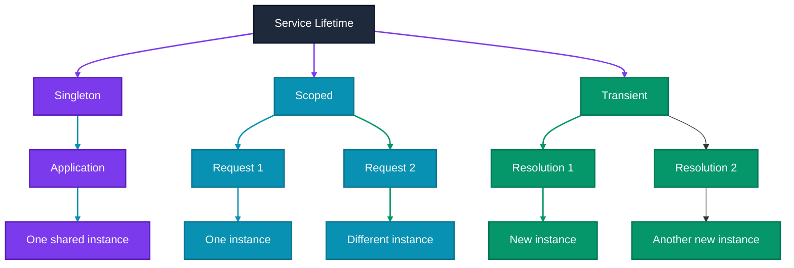

| Lifetime      | How often is an instance created? | Shared between requests? | Common use                          |
| ------------- | --------------------------------- | ------------------------ | ----------------------------------- |
| **Singleton** | Once for the application lifetime | Yes                      | Shared, thread-safe services        |
| **Scoped**    | Once per request scope            | No                       | `DbContext`, request-level services |
| **Transient** | Every time it is resolved         | No                       | Lightweight, stateless services     |

A useful way to remember them:

> **Singleton = one for the application**
> **Scoped = one for the request**
> **Transient = one for each resolution**

## How DI Fits Everything Together

Let's bring everything together.

A typical ASP .NET Core Web API application might have a controller that depends on a service, which depends on a repository.

You don't need to manually create each object.

Instead, you register the relationships with the DI container:

```csharp
builder.Services.AddScoped<IMyService, MyService>();
builder.Services.AddScoped<IRepository, Repository>();
```

Then ASP .NET Core builds the dependency graph automatically.

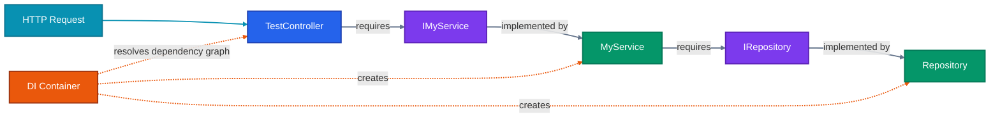

When ASP .NET Core creates `TestController`, it sees that the controller requires `IMyService`.

It looks up the registered implementation.

`IMyService` maps to `MyService`.

Then `MyService` requires `IRepository`.

The container resolves `IRepository` to `Repository`.

The dependency graph is therefore resolved from the outside rather than each class constructing its own dependencies.

That's the real value of Dependency Injection.

Your classes can focus on their responsibilities while the DI container takes care of constructing and connecting the objects.

If you remember only one thing from this chapter, remember this:

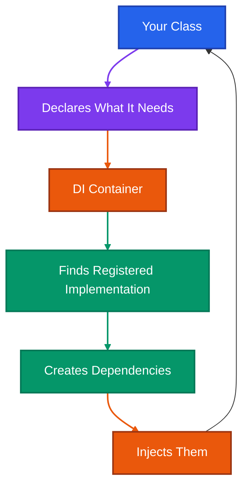

Instead of writing:

```csharp
var repository = new Repository();
```

inside your service, you declare:

```csharp
public MyService(IRepository repository)
{
    _repository = repository;
}
```

Then you tell ASP .NET Core:

```csharp
builder.Services.AddScoped<IRepository, Repository>();
```

ASP .NET Core takes care of the rest.

That separation of responsibilities is what makes Dependency Injection such an important part of modern ASP .NET Core applications.

That’s it for DI for now.
