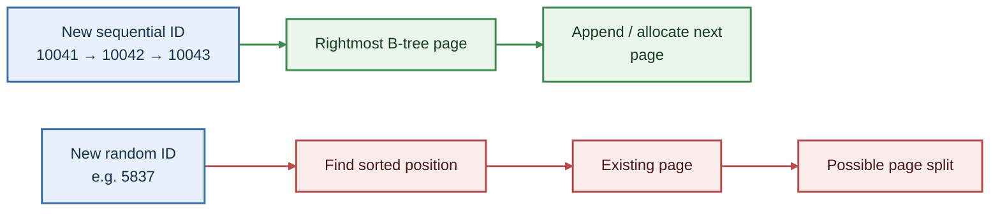

Every application with a database makes this decision on day one, usually without thinking about it: how do you assign each row a unique ID? Most frameworks pick for you, an auto-incrementing number, done.
It feels like a solved problem, one of the few genuinely boring choices left in software.

It isn't.

The ID you choose for a row's primary key, the column that uniquely identifies it and that every other table points to when it wants to reference that row, quietly shapes how fast your database can write data, how easily you can scale across multiple servers, and how much information you leak to anyone who looks at a URL.

Get it wrong at small scale and nothing happens. Get it wrong at large scale and you're rewriting your schema under pressure, migrating billions of rows with foreign keys pointing at every one of them.

This piece walks through the real design space:

- what a primary key has to do
- the mechanism that makes some ID types faster than others
- six approaches: plain auto-incrementing numbers, two flavors of UUID, ULID, Snowflake IDs, and CUID2
  that cover a broad range of production systems today.

Let's take an exampl of an online store, and grow it from a single server to a distributed, multi-region system. That lets each ID type's trade-offs show up as consequences for the same system rather than as abstract bullet points.

## Foundations: What a Primary Key Actually Has to Do

Start with the store. It has an `orders` table. Every time a customer checks out, a new row goes in, and that row needs an ID, something every other part of the system can use to say "this specific order, not any other one."

That sounds like a one-property requirement: uniqueness.

In practice, uniqueness alone is nearly free. You could hash the order's contents, or generate 128 random bits, and collisions would be extraordinarily unlikely. The real design problem is that a good primary key has to satisfy several other properties at once, and different ID schemes make different trade-offs between them.

Here's the vocabulary you'll need for everything that follows.

**Uniqueness scope.** Unique against what? A single-node counter can guarantee that no two rows in one database ever collide. But the moment the store adds a second database server say, one for European customers and one for Indain customers, that guarantee breaks unless the ID scheme was designed for multiple machines to generate IDs independently without collisions.

**Monotonicity and sortability.** Do IDs come out in increasing order over time? If order #10042 was created after order #10041, a monotonic ID scheme guarantees the second number is larger. This matters for more than tidiness: it directly affects how efficiently a database can insert new rows into an ordered index.

**Size.** How many bytes does the ID take up? This isn't just disk space. It's every index entry, every foreign-key column, and every row that references it. A 16-byte ID instead of an 8-byte one doubles the storage required for that key itself. Across a large table and multiple indexes, that can mean real memory and disk pressure.

**Mutability.** Can the ID ever need to change after it's assigned? Well-designed primary keys almost never change, but the ID-generation scheme still needs to be considered alongside migrations and schema evolution.

**Predictability and enumerability.** Can someone guess other valid IDs from one example? If order IDs go 10041, 10042, 10043, then anyone who sees their own order URL can guess other IDs. That's not itself an authorization vulnerability, but it makes enumeration straightforward if an authorization check is missing.

**Human-readability.** Can a person read the ID aloud, type it into a support ticket, or distinguish two IDs easily? A phone support agent asking a customer to read `a3f9e21c-88b4-4e2a-9c1d-7f6e5d4c3b2a` is a different experience from asking for something like `ORD-2847193`.

No ID scheme wins on every axis.

BIGINT auto-increment is compact and fast but predictable. Random UUIDs are difficult to guess but have poor insertion locality. UUID v7, ULID, and Snowflake introduce time ordering to improve locality while accepting different trade-offs.

The rest of this article is about understanding those trade-offs.

## How Index Structure Determines ID Performance

Before comparing ID types, there's a mechanism you need to understand. Without it, claims such as "random UUIDs hurt performance" are just something you've read rather than something you can reason about.

### What an Index Actually Is

A database table's rows aren't necessarily searched by scanning every row. Databases commonly use structures such as a **B-tree**, short for "balanced tree" to make lookups efficient.

Think of a phone book. Rather than scanning every page to find "Sam," you can jump toward the S section because entries are kept in sorted order.

A B-tree works similarly. Each page contains a range of key values, and the tree structure lets the database navigate to the page containing the desired key without scanning the entire index.

There is an important distinction between database engines here.

In a **clustered index**, the table's actual row data is stored in the same structure, ordered by the primary key. MySQL's default InnoDB storage engine works this way: the primary key determines the clustered layout of the table.

PostgreSQL works differently. It stores table rows in a heap and maintains a separate B-tree index for the primary key by default. The index still has the same ordered-key behavior, but it points to heap rows rather than determining their physical storage order.

### Why Insert Order Matters

When a new row is inserted, the database has to place its key into the correct sorted position in the B-tree.

If new keys always arrive in increasing order as they do with an auto-incrementing counter, every new row lands at the end of the current key range. Once that page fills up, the database can allocate another page and continue.

This gives the database strong locality: recently inserted keys tend to affect the same small region of the index, which is likely to remain in memory.

Random keys behave differently.

A new key can belong anywhere in the existing range. The database has to navigate to that location, potentially touching a page that isn't currently in memory. If that page is already full, inserting the new key can trigger a **page split**: the database divides the page's contents across multiple pages and updates the tree structure.

Page splits can mean additional writes, temporarily less-efficient page utilization, and additional work maintaining the index. At scale, these effects are often discussed in terms of fragmentation and write amplification.



This is the mechanical reason auto-incrementing IDs are fast to insert, and it is also the mechanism that later explains why random UUID v4 values can be expensive for large, write-heavy indexes while time-ordered UUID v7 values recover much of that locality.

How much the difference matters depends heavily on table size, hardware, cache behavior, workload, concurrency, and database engine. Modern SSDs, large memory configurations, and database-specific implementation details all affect the magnitude of the effect.

The mechanism is stable, any particular benchmark number is not universal. Real benchmarks should therefore be treated as evidence for a workload, not as a guarantee for every database.

With that mechanism in place, we can now look at the actual ID schemes.

## BIGINT Auto-Increment

This is the default.

Most frameworks, left to their own devices, will create a primary key column that is a **BIGINT**, a database integer type capable of storing values up to about 9.2 quintillion when signed and configure it to auto-increment.

In PostgreSQL, this is commonly implemented using an `IDENTITY` column, with `SERIAL` available as an older shorthand. In MySQL, it is commonly implemented with the `AUTO_INCREMENT` attribute.

Mechanically, this is about as simple as it gets.

The database maintains a counter, advances it when rows are inserted, and returns the new value. No client-side coordination, randomness, or timestamp is required.

### Why BIGINT Is Fast

This is exactly the sequential insert pattern from the previous section.

Every new order gets a number higher than the previous one, so new keys are inserted at the end of the ordered key range. That provides excellent locality.

It is also compact: 8 bytes for the integer itself, compared with 16 bytes for a UUID.

Across a table with a billion rows, and across indexes and foreign keys that contain the key, that difference can become significant.

### Where BIGINT Breaks Down

The main architectural limitation appears when multiple independent systems need to generate IDs.

Imagine the store expands and now has order-processing services running in both the IND and EU. Each service writes to its own regional database for latency and operational reasons.

Each database has its own auto-increment counter.

Both can generate order #4001.

When those datasets eventually need to be merged perhaps for global reporting or a migration, the IDs collide. The number alone no longer identifies a globally unique order.

This is the **coordination problem**: a single counter works extremely well when one authority generates IDs, but independent writers need some additional mechanism to guarantee uniqueness.

### Predictability

There is another consideration: predictability.

If a customer's confirmation page is:

```text
/orders/40182
```

then other values are easy to guess.

That doesn't automatically create a security vulnerability. The application must still incorrectly authorize access for an attacker to retrieve another customer's order.

This is related to **IDOR**, or Insecure Direct Object Reference. OWASP treats this as part of the broader Broken Access Control category. Hard-to-guess identifiers can make enumeration harder, but they do not replace authorization checks.

## UUID v4: Solving Coordination, Creating a New Problem

A common solution to the multiple-writer problem is to stop relying on a central counter.

Instead, each system generates an identifier independently.

That's the purpose of a **UUID**, or Universally Unique Identifier: a 128-bit value standardized by the IETF and commonly represented as 32 hexadecimal digits separated by hyphens.

A UUID v4 is the fully random UUID variant. RFC 9562 defines UUID v4 and specifies that 122 bits are available for random data, with the remaining bits identifying the UUID version and variant.

For the store, this solves the multi-region generation problem cleanly.

The IND and EU services can generate IDs locally without coordinating with a shared counter. The probability of an accidental collision is extraordinarily small.

UUID v4 also removes the straightforward enumeration property of sequential integers.

### The Insert Locality Problem

The downside is exactly the problem described earlier.

Because the key is random, each new UUID can belong anywhere in the existing B-tree key range.

There is no "end of the index" to which new rows can consistently append.

That can mean more random page access, cache misses, and page splits as the index grows.

At sufficiently large write-heavy workloads, benchmarks can show substantial differences between sequential and random primary keys. One practitioner benchmark, for example, reported a major throughput divergence as the indexed dataset grew into the millions of rows. Such measurements are workload-specific and should not be treated as universal performance percentages.

### Storage Cost

UUIDs also require twice as much space for the raw identifier as a BIGINT:

- BIGINT: 8 bytes
- UUID: 16 bytes

That difference propagates into indexes and foreign-key columns.

UUID v4 also doesn't encode creation time, so applications normally maintain a separate `created_at` column when they need to query or sort records by creation time.

## UUID v7: Fixing Locality Without Giving Up Distributed Generation

If the main problem with UUID v4 is that its bits are random, one solution is to put time information into the identifier.

That's the idea behind **UUID v7**.

UUID v7 is also defined by RFC 9562. It remains a 128-bit UUID and can be generated independently by different machines, but its leading bits contain a Unix timestamp in milliseconds. The remainder contains randomness and other fields defined by the UUID v7 layout.

Because the timestamp occupies the most significant portion of the UUID, UUID v7 values sort approximately by creation time.

For the store's `orders` table, that means new IDs generally arrive near the end of the ordered key range, restoring much of the insertion locality lost with UUID v4.

At the same time, the IND and EU services can continue generating IDs independently without a central counter.

### Database Support Is Still Version-Sensitive

UUID v7 is a relatively new standard. RFC 9562 was finalized in 2024.

PostgreSQL 18, released in September 2025, added a built-in `uuidv7()` function. Before that, PostgreSQL applications generally relied on application-side generation or extensions for UUID v7 generation.

MySQL does not currently provide a native UUID v7 generation function; a MySQL feature request exists for native support. Applications using MySQL therefore commonly generate UUID v7 values outside the database.

This is a version-sensitive area. Check the exact database version and deployment environment before assuming native UUID v7 support exists.

### UUID v7 Is Still 16 Bytes

UUID v7 doesn't have the compactness of BIGINT.

It remains 16 bytes, so its indexes and foreign-key columns are larger than equivalent BIGINT structures.

There is also an information-disclosure consideration.

Because the timestamp is encoded into the identifier, an exposed UUID v7 can reveal approximate creation time and the relative ordering of identifiers.

For an internal primary key that never leaves the database, this may not matter.

For a public-facing order identifier, it can reveal information about when records were created and, depending on what other IDs are observable, potentially provide clues about activity levels.

### The Current Adoption Direction

UUID v7 has also started appearing in database libraries, frameworks, and ORMs following its standardization. PostgreSQL's native support and ecosystem activity around Rails, Django, Prisma, and other projects are examples of that broader movement.

That is useful evidence about current adoption, but it should not be interpreted as proof that UUID v7 is the right choice for every application.

A database's existing capabilities, workload, architecture, and operational requirements still matter.

## ULID: A Similar Idea With a Different Standard

UUID v7 wasn't the first identifier to combine time ordering with randomness.

**ULID**, or Universally Unique Lexicographically Sortable Identifier, has used the same broad idea for years.

A ULID contains:

- 48 bits of millisecond timestamp
- 80 bits of randomness

It is normally represented as 26 characters using **Crockford Base32**, an encoding designed to avoid several visually confusing characters.

For example:

```text
01ARZ3NDEKTSV4RRFFQ69G5FAV
```

This representation is compact as text and naturally lexicographically sortable.

### ULID's Standardization Trade-off

ULID's main distinction from UUID v7 isn't the fundamental idea. Both use time ordering and randomness.

The difference is standardization.

ULID's specification is maintained as a community specification rather than an IETF RFC.

UUID v7, by contrast, is part of the standardized UUID specification in RFC 9562.

That does not make ULID technically unusable. It means teams should consider ecosystem support, existing libraries, interoperability requirements, and the value they place on using an established standard.

For a system that already has strong ULID support, ULID can remain a practical choice. For a new system where interoperability and standardized UUID semantics matter, UUID v7 offers a closely related approach with formal standardization.

## Snowflake ID: Distributed, but Still a Number

Everything since BIGINT has largely involved making globally generated identifiers compatible with distributed systems.

Snowflake takes a different approach.

Keep the identifier numeric, but encode enough information into it to make independent generation possible.

Twitter introduced the original Snowflake design in 2010 for generating unique IDs across many machines without relying on a shared database counter.

The original design uses a 64-bit integer containing three main components:

- 41 bits for a millisecond timestamp
- 10 bits for a machine or worker identifier
- 12 bits for a per-machine sequence number

That gives each worker its own namespace while allowing many IDs to be generated within the same millisecond.

For the store, the IND and EU services could each have a distinct worker identifier. Each service could then generate IDs locally without a shared database counter.

Because the timestamp occupies the leading portion, the resulting values are roughly time-ordered.

And because the identifier fits into 64 bits, it can fit naturally into a BIGINT-sized database column.

### Snowflake's Operational Cost

The distributed generation isn't free.

Someone has to assign and manage worker IDs.

Two active machines cannot accidentally use the same worker ID without risking collisions.

That means Snowflake-style systems have an operational coordination requirement even though individual ID generation doesn't require a network round-trip.

Clock behavior is another consideration.

Because the timestamp is part of the ID, a system clock moving backward can break monotonicity and potentially create problems for naive implementations. Production implementations need explicit handling for clock skew and timestamp regressions.

### There Is No Single Snowflake Format

"Snowflake ID" is better understood as a family of designs than as one universal standard.

Twitter's original layout is one implementation. Other organizations have modified the allocation.

Discord uses a similar 64-bit concept with its own epoch.
Instagram uses a different bit allocation.
Sonyflake uses a different timestamp resolution and layout.

So adopting "Snowflake" requires choosing a particular implementation and bit layout rather than simply implementing a universal standard.

## CUID2: Choosing Unpredictability Over Sortability

The schemes so far have generally treated time ordering as useful.

CUID2 takes a different position.

CUID2, from the `@paralleldrive/cuid2` project, combines multiple entropy sources, including time, process-level state, machine-related information, and cryptographically sourced randomness, before applying hashing to produce the final identifier.

A resulting identifier can look like:

```text
tz4a98xxat96iws9zmbrgj3a
```

The resulting string does not expose an obvious timestamp, worker ID, or sequence number.

This is intentional.

CUID2's documentation argues that identifiers containing timestamps can reveal information about when records were created and potentially allow observers to infer activity levels from exposed IDs. It therefore does not optimize for chronological sorting.

That makes CUID2 conceptually different from UUID v7, ULID, and Snowflake.

Those schemes accept some amount of timestamp visibility in exchange for ordering and insertion locality.

CUID2 deliberately avoids that trade.

For applications where identifiers are frequently exposed to users invite codes, public content IDs, or other externally visible identifiers hiding creation-time information may be more important than making the identifier naturally sortable.

Like ULID, CUID2 is a community project rather than an IETF-standardized identifier format.

The practical question is therefore not whether CUID2 is "better" than UUID v7. It is solving a somewhat different problem "making IDs difficult to predict while avoiding obvious timestamp/sequence information."

CUID2 does not solve page splits. In fact, from a B-tree primary-key perspective, CUID2 behaves much more like UUID v4 than UUID v7.

## The Comparative Decision Framework

Six schemes, six different trade-offs.

The following table compares them using the properties introduced at the beginning of the article.

| Scheme                |                                                    Size | Sortable           | Insert locality | Coordination needed      | Enumerable                                        | Standardized                          |
| --------------------- | ------------------------------------------------------: | ------------------ | --------------- | ------------------------ | ------------------------------------------------- | ------------------------------------- |
| BIGINT auto-increment |                                                 8 bytes | Yes                | Excellent       | Yes, centralized counter | Yes                                               | Widely supported SQL/database concept |
| UUID v4               |                                                16 bytes | No                 | Poor            | No                       | No                                                | Yes, RFC 9562                         |
| UUID v7               |                                                16 bytes | Yes                | Good            | No                       | Not directly enumerable, but timestamp is visible | Yes, RFC 9562                         |
| ULID                  | 16 bytes as binary, 26 characters in standard text form | Yes                | Good            | No                       | Not directly enumerable, but timestamp is visible | No, community specification           |
| Snowflake             |                                                 8 bytes | Yes, approximately | Good            | Worker-ID allocation     | Partially, because structure is visible           | No, implementation-specific           |
| CUID2                 |                                  Variable-length string | No, by design      | Poor            | No                       | No obvious sequence or timestamp to enumerate     | No, community project                 |

Several trade-offs stand out.

Sequential identifiers provide excellent locality, but centralized counters introduce coordination and sequential values are easy to enumerate.

Random identifiers remove the coordination requirement and make enumeration difficult, but random insertion can reduce index locality.

Time-ordered identifiers sit between those extremes. UUID v7, ULID, and Snowflake all introduce temporal structure to improve ordering and locality, while accepting some exposure of timing information.

CUID2 deliberately gives up sortability to avoid exposing that structure.

There isn't a single identifier that simultaneously provides compact storage, excellent locality, decentralized generation, complete unpredictability, and no operational trade-offs.

### Two Common Design Approaches

There are two broad approaches that frequently emerge when teams make this decision.

**Use UUID v7 as the primary identifier.**

The reasoning is straightforward: it is standardized, supports distributed generation without a central counter, retains temporal ordering, and addresses much of the insertion-locality problem associated with UUID v4. Native database and framework support is also expanding.

This approach can be attractive for systems expected to distribute ID generation across services or regions from the beginning.

**Use BIGINT internally and a separate opaque public identifier.**

Here, the primary key remains an internal implementation detail. Foreign keys and indexes use the compact BIGINT, while a second identifier perhaps a UUID, ULID, or CUID2 is exposed through URLs or APIs when an opaque external identifier is useful.

This separates two concerns:

- the database gets a compact, efficient internal key
- the public API gets an identifier that isn't trivially enumerable

The choice depends on the application's architecture, write patterns, expected scaling model, and whether primary keys are exposed outside the system.

A single-server application that never exposes its internal identifiers has less need for distributed ID generation.

A system expected to generate IDs independently across regions has a stronger reason to avoid a single centralized counter.

The ecosystem is also still changing. UUID v7's standardization is recent, database support is arriving incrementally, and framework defaults and libraries continue to evolve. Check the versions actually used by your application rather than relying on what a framework or database supported several years ago.

## Applied Concerns: Migration, Sharding, and Exposure

Choosing an ID scheme is easiest before the first production row exists.

Changing it later can be considerably harder.

### Migration

Converting a primary key from BIGINT to UUID, for example, is rarely just a single `ALTER TABLE`.

Every foreign key that references the primary key also has to be considered.

A large migration might require:

1. Adding a new identifier column.
2. Backfilling it for existing rows.
3. Adding corresponding identifiers to referencing tables.
4. Keeping old and new identifiers synchronized while the application continues running.
5. Updating application code and foreign-key relationships.
6. Switching constraints and primary-key definitions.
7. Removing the old identifiers only after the migration is complete.

The exact procedure depends heavily on the database, schema, table size, application architecture, and availability requirements.

The important architectural point is simple: changing a primary-key strategy later can become a cross-system migration rather than a local schema change.

### Sharding

Suppose the store eventually needs to split its `orders` table across multiple physical databases.

The ID scheme directly affects how independently those shards can generate identifiers.

A Snowflake-style ID embeds a worker or shard identifier, allowing different shards to generate IDs independently.

A BIGINT auto-increment counter does not inherently contain that information. A sharded design therefore needs another mechanism, such as allocating disjoint numeric ranges or using a separate ID-generation service.

This is one reason distributed identifier schemes become more interesting as systems move from one database writer to many.

### Security and Exposure

The distinction between ID design and authorization is critical.

A predictable BIGINT makes enumeration easy.

An opaque UUID, ULID, or CUID2 makes guessing harder.

Neither one replaces authorization.

OWASP's IDOR guidance emphasizes that an application must verify that the requesting user is authorized to access the requested object. An identifier that is difficult to guess is not a substitute for that check.

Consider:

```text
GET /orders/40182
```

If the application checks only whether the request contains a syntactically valid ID, changing the identifier can expose another customer's order.

Replacing `40182` with a UUID makes random guessing more difficult, but it does not fix the authorization failure if an attacker obtains a valid UUID through another channel.

ID choice is therefore primarily a database and architecture decision, with security benefits that are useful but limited.

## Bringing It Back to the Store

We started with a single-server `orders` table and gradually introduced the constraints that appear as the system grows.

BIGINT worked well when one database generated the identifiers.

The store then added independent IND and EU writers, creating a need for decentralized ID generation.

UUID v4 solved the coordination problem, but introduced random insertion patterns.

UUID v7 and ULID added temporal ordering to recover much of that locality.

Snowflake kept the identifier numeric while embedding timestamp, worker, and sequence information to support distributed generation.

CUID2 took a different route, prioritizing an identifier without an obvious timestamp or sequential structure over chronological sorting.

Each scheme is therefore a response to a different set of requirements.

The useful questions are not simply "Which ID is best?"

Instead, ask:

- How many independent systems need to generate IDs?
- Will the data eventually span multiple database instances or regions?
- How write-heavy is the workload?
- How large will the primary-key indexes become?
- Are the IDs exposed through URLs or APIs?
- Does the system need creation-time ordering?
- Is a standardized format important to the ecosystem?
- Is keeping the primary key compact especially valuable?
- How difficult would an ID migration be if the architecture changes later?

Those questions turn ID selection from a popularity contest into an architectural decision.

There is no universal answer. The right choice depends on which constraints your system actually has and which trade-offs you are willing to accept.
