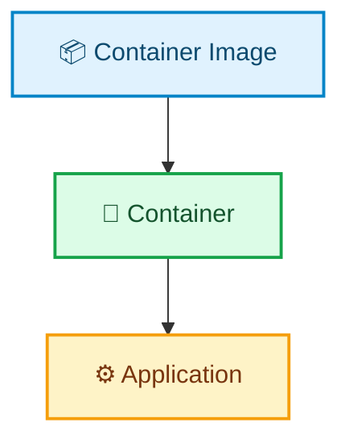

# Virtualization & Containerization

There are cases where an application works perfectly on a developer's system but fails to run on someone else's system. This can happen because of differences in installed packages, dependencies, system configuration, hardware, operating system, or other environmental factors.

If we want to run the application on other systems, we may need to recreate an environment similar to the development environment. Even if we can achieve this, what if we have to do it on hundreds of systems? There is a problem, right?

Virtualization and containerization provide ways to create isolated and reproducible environments, making it easier to run applications consistently across different environments.

Traditional servers were essentially physical computers with hardware and an operating system installed on top of it. Applications would then run on that operating system. Often, a physical server was dedicated to a specific workload.

This approach could lead to inefficient resource utilization because a server might have unused CPU, memory, or storage capacity. It could also make scaling and managing multiple workloads more difficult.

Virtualization was introduced as a way to address many of these challenges.

## Virtualization:

Virtualization is a technology that abstracts physical computing resources to create isolated virtual environments, such as virtual machines (VMs), that can share the underlying hardware.

A virtualization layer, typically provided by a hypervisor, allows multiple virtual machines to run on the same physical machine. Each VM has its own virtual hardware and can run its own guest operating system.

This allows organizations to make better use of physical resources by running multiple workloads on a single physical server. It can also improve scalability, flexibility, and resource utilization.

### How does it work?

Virtualization is enabled by a software layer called a hypervisor. The hypervisor manages the physical resources of the host machine and provides virtual hardware to virtual machines.

Each virtual machine sees virtual CPUs, memory, storage, network interfaces, and other devices. The guest operating system and applications interact with these virtual resources, while the hypervisor manages how those resources are mapped to the underlying physical hardware.

There are 2 main types of hypervisor software:

- **Type 1 hypervisor**: A Type 1 hypervisor runs as the primary virtualization layer on the physical host and manages hardware resources for virtual machines. It is commonly used in servers and data centers. Examples include Microsoft Hyper-V and VMware ESXi.

- **Type 2 hypervisor**: A Type 2 hypervisor runs on top of a host operating system. The host operating system provides the underlying hardware and system services that the virtualization software uses. Examples include VMware Workstation and Oracle VirtualBox.

Modern hardware-assisted virtualization can make the performance overhead relatively small for many workloads. However, the actual performance depends on the hardware, hypervisor, workload, configuration, and other factors.

Due to the presence of an additional layer (hypervisor), there is a noticeable decrease in performance unless more resources are allocated. This is solved by containerization.

## Containerization:

Containerization is another approach to application isolation and deployment. Instead of running a complete guest operating system for every application, containers typically share the host operating system's kernel while keeping applications and their processes isolated from one another.

A container image packages an application together with its userspace dependencies, such as libraries and configuration files. The image can then be used to create and run containers.

Because containers typically share the host kernel, they can be much lighter than virtual machines and can start much faster. This also allows many containers to run on a single host with less overhead than running a separate virtual machine for each application.

Popular container technologies and runtimes include Docker, LXC, and CRI-O.

It is important to note that containerization does not mean that containers can never use virtual machines. Containers can run inside virtual machines, and this architecture is commonly used by container platforms on some operating systems.

### Image vs Container

A container image is a packaged template containing an application's userspace filesystem and configuration.

A container is a running instance created from an image.

The same image can be used to create multiple containers, allowing applications to be deployed consistently across compatible environments.

## Virtualization vs Containerization

Virtualization and containerization are related technologies, but they provide isolation at different levels.

The key difference is that a VM normally has its own guest operating system and kernel, while a container typically shares the host operating system's kernel.

This difference makes containers generally lighter and faster to start, while virtual machines provide greater isolation and can run different operating systems on the same physical host.

## Which option should you use?

The choice between virtualization and containerization depends on the requirements of the application and the infrastructure.

Virtual machines may be a better choice when:

- The application requires a different operating system or kernel.
- Strong isolation between workloads is required.
- The application has OS-level or kernel-level dependencies.
- You need to run multiple operating systems on the same physical machine.
- You are running legacy applications that require a specific OS environment.

Containers may be a better choice when:

- The application can run with the host operating system's kernel.
- Fast startup and efficient resource usage are important.
- You want a consistent and reproducible application environment.
- You want to package applications with their userspace dependencies.
- You need to run many isolated application workloads on the same host.

Virtualization and containerization can also be used together. For example, a physical server can run virtual machines, and those virtual machines can run containers.

Ultimately, the right choice depends on the application's compatibility requirements, isolation needs, performance requirements, and the infrastructure in which it will run.
