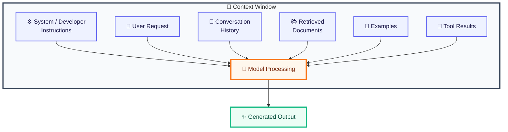
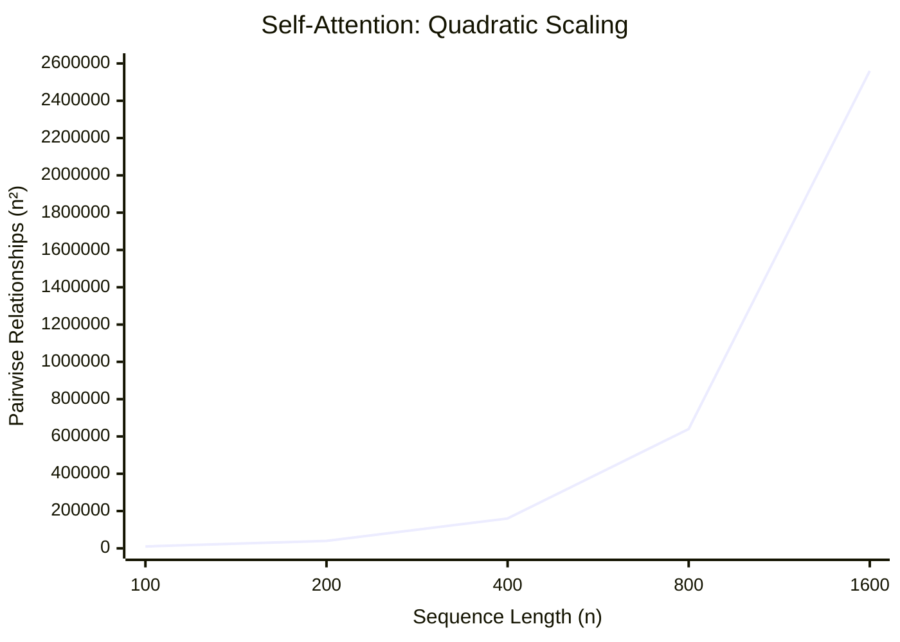
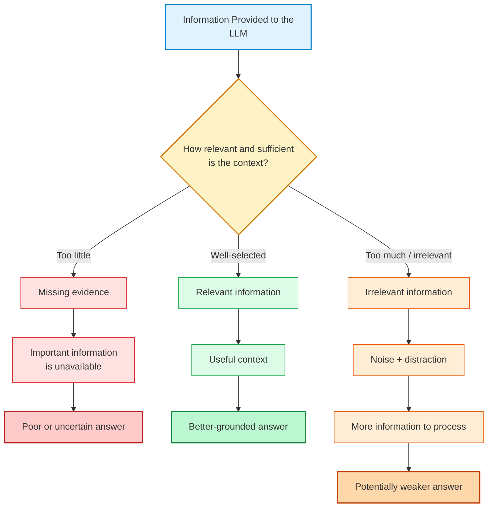
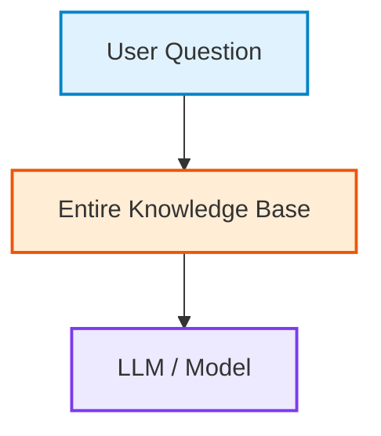
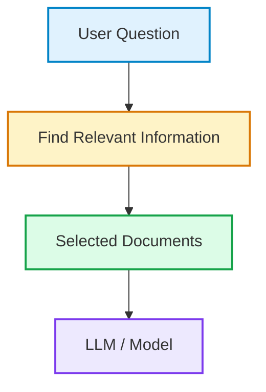
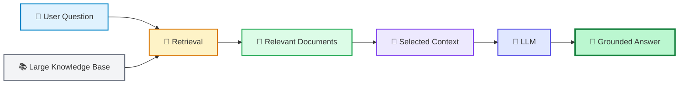
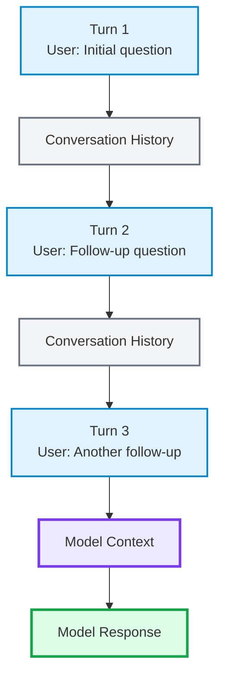
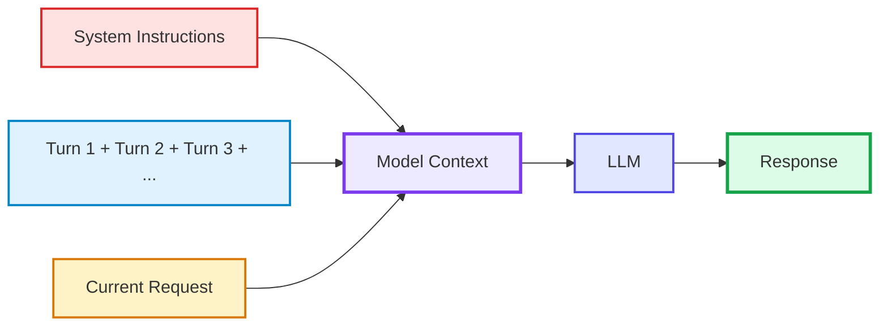

The instruction hierarchy gives us a way to reason about authority. The next constraint is physical: **the model cannot process an unlimited amount of context at once.** Even when a model advertises a very large context window, more context is not automatically more useful.

### Context windows

A **context window** is the amount of input and generated context that a model can handle within a single request or interaction, measured in tokens.

Think of it as the model’s working desk.

If the desk is small, you have to choose what documents to put on it. If the desk is very large, you can put much more material there, but that does not mean the model will use every document equally well.

A simplified request might look like:



The available context is finite. Tokens consumed by instructions, user messages, documents, examples, and previous conversation turns all compete for that space.

The exact limits vary considerably across models. For example, OpenAI’s current documentation lists context windows reaching into the million-token range for some GPT-5.6 models, with maximum output limits specified separately. Anthropic’s Claude models likewise support large context windows, though their context and output limits vary by model and version.

That distinction is important because **context capacity and output capacity are not the same thing**.

#### Input tokens vs output tokens

Suppose an application sends:

> 80,000 input tokens

and asks the model to produce:

> 10,000 output tokens

The application needs to satisfy the relevant limits for both the model’s context and its maximum generated output.

A useful abstraction is:

> Available context = input context + space required for generation

The exact accounting rules depend on the model and API, so production systems should use the provider’s current documentation rather than assuming a universal formula.

This is why token accounting becomes an engineering problem.

Our document-summarization application might initially work perfectly:

```plaintext
Instructions: 500 tokens
User request: 50 tokens
Document: 5000 tokens
Output: 500 tokens
```

Now suppose customers start uploading 200-page documents.

The document might consume tens of thousands of tokens. If the application also includes conversation history, retrieved material, examples, and tool results, the context can grow rapidly.

The prompt has not necessarily become “better.” It has become **larger**.

### What happens when context becomes too large?

There are several possible outcomes, depending on the model and application.

The request may exceed the model’s supported context limit and be rejected. The application may truncate older material. It may summarize the conversation. It may retrieve only selected sections of a larger knowledge base.

This is an important transition in our thinking.

A naïve prompting strategy says:

> **_Give the model all the information._**

A context-engineering strategy asks:

> **_Which information does the model actually need for this task?_**

That is a much better question.

Consider our customer-support application. Suppose the customer’s history contains 300 previous messages, but only three are relevant to the current authentication error.

Sending all 300 messages may consume tokens unnecessarily and introduce irrelevant material.

A better system might construct:

```plaintext
Application instructions
        +
current user request
        +
relevant account state
        +
three relevant historical messages
        +
relevant documentation
```

The goal is not to maximize context.

**The goal is to maximize useful context.**

This distinction becomes one of the central ideas of context engineering later in the article.

### Context length is not the same as useful capacity

A model advertised with a million-token context window can technically accept a very large input. But that does not imply that every token receives equal attention or contributes equally to the answer.

This is one of the most important findings in long-context research.

In the study “_Lost in the Middle: How Language Models Use Long Contexts”_, researchers tested whether models could reliably find relevant information at different positions in long inputs. They found that performance could degrade substantially when the relevant information appeared in the middle of the context, with performance often stronger when relevant information appeared near the beginning or end. This effect appeared even in models designed to handle long contexts.

That result gives us a useful warning:

> **_A context window describes what the model can accept, not how effectively it will use every piece of accepted information._**

This is why simply increasing the context size is not equivalent to giving the model perfect memory.

### Long-context models

A **long-context model** is a model designed to process substantially longer input sequences than earlier models.

The underlying engineering problem is difficult because transformer attention has traditionally become more expensive as sequence length grows. In standard self-attention, the number of pairwise token relationships grows roughly with the square of sequence length. This is commonly described as quadratic scaling.



If the sequence length doubles, the number of pairwise relationships considered by full self-attention can grow by roughly four times.

That does not mean every modern long-context model literally performs naïve full attention in every circumstance. Researchers have developed many approaches to reduce the computational burden, including **sparse attention** , **local attention** , architectural modifications, and other techniques.

But the fundamental systems problem remains:

**Longer context requires the model and serving infrastructure to handle more information and computation.**

This produces several practical trade-offs.

Longer context can reduce the need to retrieve or summarize information aggressively. It can make tasks involving large documents easier to implement. It can allow an application to preserve more conversation history.

But it can also increase:

- computational cost
- latency
- memory requirements
- irrelevant information
- opportunities for conflicting instructions
- difficulty locating the most important information

So “long context” is an engineering capability, not a blanket solution.

### The lost-in-the-middle problem

Return to our customer-support system.

Imagine that it sends the model 100 support documents:

```plaintext
Document 1
Document 2
Document 3
...
Document 50 ← contains the crucial authentication rule
...
Document 100
```

The relevant rule is present.

The model technically has access to it.

Yet the presence of the information does not guarantee that the model will use it correctly.

This is the essence of the **lost-in-the-middle** effect.

The original study found that model performance could fall when relevant information was placed in the middle of long contexts rather than near the beginning or end.

Later research has continued to investigate this phenomenon, including settings where several pieces of information must be combined rather than retrieved independently.

This has an immediate prompting consequence.

If a particular instruction or piece of evidence is critical, blindly placing it somewhere inside thousands of tokens may be a poor design.

A context-aware application can instead:

1. identify the relevant information,
2. remove irrelevant material,
3. organize the remaining material clearly,
4. place important instructions where they are likely to remain salient,
5. and test the resulting system empirically.

Notice what happened here.

We started with prompt writing and arrived at **information selection**.

That is the beginning of context engineering.

### More context can make an answer worse

It is natural to assume:

> more information = better answer

For LLM applications, the relationship is often closer to:



Suppose the model needs one paragraph from a 500-page product manual.

Giving it the entire manual may sound safer than selecting one paragraph. But if most of the manual is irrelevant, the application has increased the amount of material the model must process without necessarily increasing the evidence relevant to the question.

This is one reason retrieval systems exist.

Instead of:



a retrieval-based system can use:



Retrieval-augmented generation, or **RAG** , is a system design in which relevant external information is retrieved and supplied to a language model as context when generating an answer.

We will examine RAG much later. For now, the important point is that **context selection can be more valuable than context expansion**.

### Long context vs retrieval

Long context and retrieval solve related but different problems.

Imagine a company has 10 million support documents.

A million-token context window does not mean the application should put the entire knowledge base into every request.

Retrieval allows the application to search the larger information store and select a smaller subset relevant to the current task.

The two approaches can therefore coexist:



The long context provides capacity.

Retrieval provides selection.

Neither automatically solves the other problem.

A model with a huge context can still be distracted by irrelevant information. A retrieval system can still retrieve the wrong documents. A good application therefore needs both an appropriate context strategy and evaluation.

### Context relevance

This gives us a useful way to think about prompt quality.

Suppose two prompts contain:

> Prompt A: 2,000 highly relevant tokens

and:

> Prompt B: 2,000 relevant tokens + 30,000 loosely related tokens

Prompt B contains more information, but it may be a worse prompt.

The additional material can introduce competing facts, contradictory instructions, outdated information, or simply more material the model must navigate.

This leads to an important engineering principle:

**Context should be selected for relevance, not collected indiscriminately.**

That principle will become increasingly important when we discuss conversation history and memory.

### Conversation history

A chat interface can make it appear as though the model simply “remembers” everything you have said.

Usually, a more precise description is:

**The application supplies some or all of the previous conversation as part of the model’s current context.**

Imagine three turns:

> User: My application uses version 8.4.  
> Assistant: Understood.  
> User: What configuration should I change?

For the model to answer correctly, the application may include the earlier statement:

> My application uses version 8.4.

The model can then use that information when generating the new response.

Conceptually:



This is why conversation history consumes context.

Every retained turn adds tokens to future requests.

A short conversation may make this irrelevant. A long-running support session can make it a major engineering problem.

### Full-history prompting

The simplest strategy is to send the entire conversation every time:



This is called **full-history prompting**.

Its advantage is simplicity. The model can see everything the application has retained.

Its disadvantage is growth.

If every turn adds 500 tokens, then after 100 turns the conversation may contain tens of thousands of tokens. If each new request resends that history, the application repeatedly processes much of the same information.

And not every historical turn is useful.

Our customer-support conversation might contain:

```plaintext
User:
My product version is 8.4.

User:
I am using Linux.

User:
Thanks.

User:
Actually, unrelated question: what is the weather tomorrow?

User:
Back to the authentication problem...
```

Sending every historical message gives the model more context, but not necessarily better context.

A production system therefore needs strategies for deciding what conversation state should survive into future requests.

### Truncation and history selection

One simple strategy is **truncation** : remove older messages when the conversation becomes too large.

For example:

```plaintext
Keep:
  - system instructions
  - recent 20 turns
  - current request

Remove:
  - older conversation
```

This is easy to implement but can discard important information.

Suppose the user established an important requirement 50 turns ago:

> _All customer-facing responses must be written in British English._

If that message is simply truncated, the model may no longer have access to the requirement.

A more sophisticated system separates **conversation history** from **conversation state**.

Instead of retaining every utterance, the application might maintain:

```plaintext
Conversation state:
  - Product version: 8.4
  - Operating system: Linux
  - Authentication issue: expired token
  - Troubleshooting step 1: completed
  - Troubleshooting step 2: pending
```

Then the next request receives the relevant state rather than the entire conversation.

This distinction is foundational.

**Conversation history is a record.  
Conversation state is the information currently needed to continue the task.**

They are not the same thing.

That difference will eventually lead us from context windows to memory systems.
