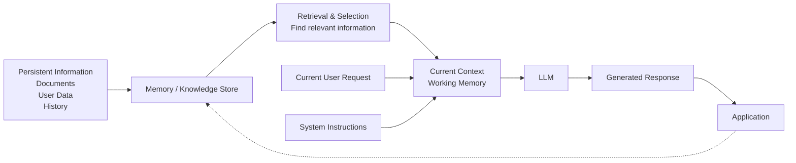
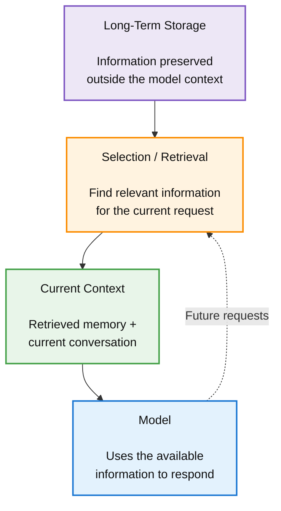
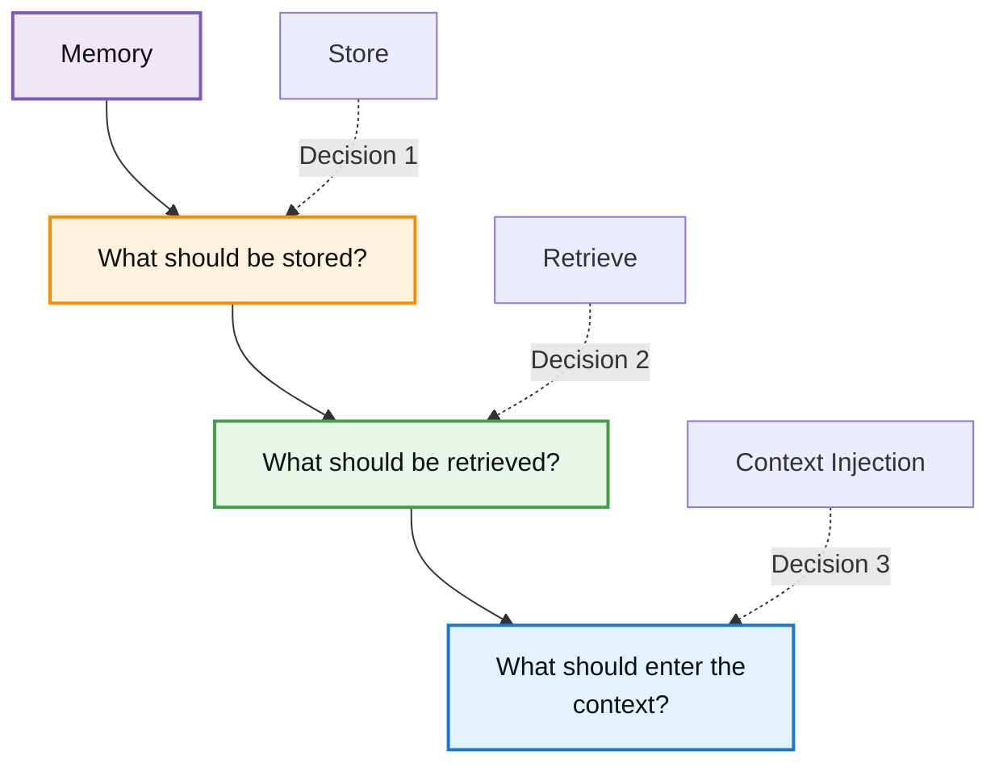
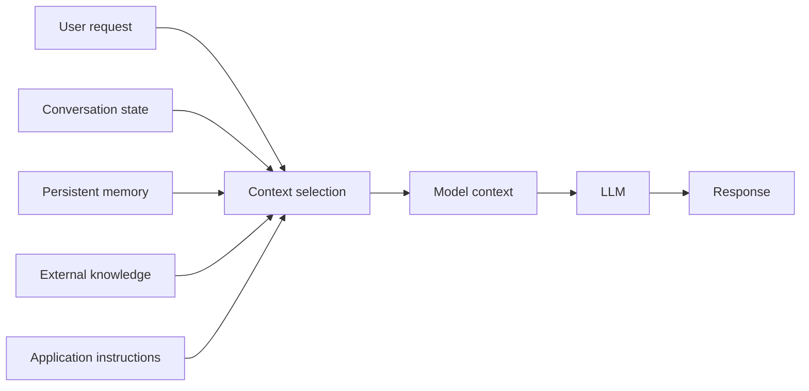

The context window tells us what the model can see at one time. But a conversation raises a harder question: **what does the model actually remember?**

The answer is more precise than the everyday use of the word “memory.”

#### Context is not necessarily memory

Suppose you tell our customer-support assistant:

> _My production system runs version 8.4 on Ubuntu._

Ten minutes later, you ask:

> _What should I check next?_

If the application includes the earlier statement in the current context, the model can use it.

But that does not necessarily mean the model has stored the fact somewhere permanent.

A useful distinction is:

```markdown
**Context** :
Information currently supplied to the model.

**Memory** :
Information deliberately retained so it can be supplied again later.
```

This difference sounds subtle, but it becomes fundamental when building applications.

If the earlier statement disappears from the model’s context, the model cannot simply “look inside itself” and retrieve that conversation fact in the ordinary sense. The application must either provide the information again or use some separate memory mechanism.

So when a chatbot appears to remember something across turns, several different mechanisms may be responsible.

The application might:

- resend the conversation history,
- maintain a compact summary,
- store selected facts in a database,
- retrieve relevant previous information,
- or use a provider’s built-in state or memory mechanism.

These are different implementations of what the user experiences as “memory.”

#### Short-term or working memory

A useful analogy is a person’s desk.

The documents currently on the desk are immediately available for the current task. Documents stored in a filing cabinet are not directly in front of the person, but they can be retrieved when needed.

For an LLM application:



The **current context** acts like working memory.

It contains the information the model can use during that particular generation.

This is why context is often described as short-term or working memory, even though the analogy should not be taken literally. The model is not necessarily maintaining a human-like memory state between requests. The application is controlling what information is placed into its current context.

This distinction prevents a common misunderstanding:

> _“The model knows this because I told it earlier.”_

A more precise question is:

> _“Where is that earlier information now, and how will it reach the model on this request?”_

That question is much more useful for engineers.

#### What happens when information leaves the context?

Imagine our support conversation has grown so large that the application removes its earliest messages.

The original statement:

> Product version: 8.4

is no longer present.

If there is no other representation of that fact, the current request no longer contains it.

The model cannot reliably use information that the application has removed from its accessible context merely because the information appeared in an earlier request.

This creates a boundary:

> Information inside current context is available LLM  
> Information outside current context requires retrieval or reintroduction to LLM

This is one reason long conversations are fundamentally a state-management problem.

A system that needs information to survive across hundreds of conversations cannot simply keep expanding the prompt indefinitely.

It needs somewhere else to put that information.

That is where persistent memory begins.

### Long-term memory

Long-term memory in an LLM application means **information stored outside the immediate model context so it can potentially be retrieved later**.

The storage mechanism might be:

- a relational database
- a document store
- a vector database
- a knowledge base
- files
- application state
- user-profile records
- a specialized memory system

The important part is not the database technology.

The important part is the separation:



Research on long-term memory systems has explored exactly this problem. LongMem, for example, proposed augmenting an LLM with a separate memory mechanism capable of retrieving information from much longer histories than the model could directly process in one input.

This changes our customer-support architecture.

Instead of retaining every historical message, the application might maintain:

```plaintext
**Customer profile:**
    Account type: Enterprise

**Current system:**
    Version: 8.4
    OS: Ubuntu

**Known issue:**
    Authentication token expiration

**Completed steps:**
    Token regenerated
    Service restarted
```

The application can retrieve the relevant state when the user returns days later.

The model does not need to receive the customer’s entire historical conversation.

### Memory storage is not memory retrieval

Storing information is only half of the problem.

Suppose the application has one million customer facts in its database.

The model cannot receive all one million facts.

It needs a retrieval mechanism that decides which information is relevant to the current request.

That produces a 3-stage problem:



These are separate decisions.

A memory system can fail by storing the wrong information.

It can also fail by storing the right information but retrieving the wrong information.

And it can retrieve the right information but place too much irrelevant material alongside it.

So “add memory” is not a complete engineering solution.

### Memory selection

Imagine our user previously told the support assistant:

> _I prefer concise explanations._

They also mentioned:

> _My office is moving next month._

Which fact should be retrieved for a technical troubleshooting question?

Probably the preference for concise explanations. The office move is irrelevant.

This illustrates **memory relevance**.

A useful memory system should not merely ask:

> _What information has this user ever provided?_

It should ask:

> _What previously stored information is relevant to this request?_

That sounds obvious, but it becomes difficult at scale.

Relevance can depend on:

- the current question
- the current task
- recency
- user identity
- application state
- previous interactions
- relationships among stored facts
- whether the information is still valid

A memory system therefore becomes a retrieval system as much as a storage system.

### Memory updating

Memory also changes.

Suppose the user initially says:

> _I use version 8.4._

Six months later:

> _We upgraded to version 9.2._

The application now has two pieces of information:

```plaintext
Version 8.4
Version 9.2
```

Both may be historically accurate.

Only one describes the current system.

This creates a **memory conflict**.

A naïve system that simply appends every new fact can accumulate contradictory information. A better system may attach timestamps, versions, confidence, provenance, or validity information.

For example:

```plaintext
System version
    value: 9.2
    source: user
    updated: recent
    status: current
```

The exact representation depends on the application, but the conceptual requirement is general:

**Persistent memory needs rules for updating and invalidating information, not just storing it.**

### Memory deletion

The inverse problem is equally important.

Some information should stop being remembered.

A user might ask an application to delete a preference or personal detail. An application may also need retention limits for security, privacy, regulatory, or operational reasons.

That means memory architecture should answer:

- What information is stored?
- Why is it stored?
- How long is it retained?
- Who can retrieve it?
- How is it updated?
- How is it deleted?
- How is its source tracked?
- What happens when two memories conflict?

These are application-design questions, not merely prompt-writing questions.

This is another important shift in the article:

**Once information persists outside the prompt, prompt engineering alone is no longer enough to describe the system.**

### Summarization as memory

There is another strategy between keeping everything and storing individual facts: **summarization**.

Suppose a 200-message conversation contains a long troubleshooting process.

Rather than retaining every message, the application might create:

```plaintext
Conversation summary:
The customer runs version 8.4 on Ubuntu.
They encountered authentication failures caused by expired tokens.
The token was regenerated and the service restarted.
The issue persisted after restart.
The next recommended step is checking service credentials.
```

Future requests can receive this summary instead of the complete conversation.

This can dramatically reduce context consumption.

But summarization introduces a new problem:

**Compression loses information.**

The summary might omit a seemingly minor detail that later turns out to matter.

For example, the original conversation may have contained:

> _The authentication error only occurs on one production server._

If the summary becomes:

> _Authentication errors persist after restarting the service._

the system has lost an important diagnostic clue.

That is **information loss**.

### Rolling summaries

A common approach is a **rolling summary**.

As the conversation grows:

```plaintext
Messages 1–20 -> Summary A
Messages 21–40 -> Summary B + relevant recent messages
```

The application continuously compresses older conversation into a smaller representation.

The advantage is controlled context growth.

The danger is **summary drift**.

Summary drift occurs when repeated summarization gradually changes or loses details from the original information.

Imagine:

```plaintext
Original conversation
       ↓
Summary 1
       ↓
Summary 2
       ↓
Summary 3
       ↓
Summary 4
```

Every transformation is another opportunity for information to disappear or be subtly changed.

This is why memory summaries should themselves be evaluated.

A summary that sounds fluent is not necessarily a faithful summary.

### When summarization is preferable

Summarization works particularly well when the application needs the **general state of a conversation** , rather than every original detail.

For example:

```plaintext
The customer is troubleshooting authentication on version 8.4.
They have already regenerated credentials and restarted the service.
```

That may be enough to continue a support workflow.

But if the application needs exact evidence, numerical values, or source quotations, summarization may be inappropriate.

The original data may need to remain available.

This gives us a useful design rule:

> **Need exact historical detail?**  
> Keep or retrieve the source.  
> **Need compact conversational state?**  
> A summary may be sufficient.

In practice, systems can combine both.

They may keep a compact summary in the active context while retaining the original conversation in external storage for retrieval when necessary.

### Hierarchical memory

The same idea can be extended into multiple levels.

For a long customer relationship:

> Recent turns  
> Conversation summary  
> Customer-level facts  
> Historical records

The model does not need every level on every request.

A simple billing question might need only current account state.

A complex support question might need the current state plus relevant historical incidents.

A dispute might require retrieval of the original conversation or source documents.

This resembles the virtual-memory approach explored by **MemGPT** , which separates immediately accessible context from information that can be moved into and out of the model’s limited working context.

The analogy is useful because it highlights a central principle:

**Memory is fundamentally an information-management problem.**

The model’s context is one layer of that system, not the entire system.

### External memory and retrieval

External memory can take several forms.

A relational database might store:

> customer_id  
> subscription  
> product_version  
> preferences

A document store might contain complete conversations.

A vector database might store numerical representations of text that allow semantically similar material to be retrieved.  
A **vector embedding** is a numerical representation of information designed so that related pieces of meaning can be located near one another in a mathematical space.

A knowledge base might store explicit entities and relationships.

A file repository might contain manuals, policies, or customer documents.

All of these can become sources of context.

This is closely related to retrieval-augmented generation, or **RAG**. The original RAG work combined a language model’s internal, learned knowledge with an external non-parametric memory that could be retrieved during generation.

The distinction between memory retrieval and knowledge retrieval is useful:

```plaintext
**Memory retrieval:**"What did this user or application previously know/do?"
**Knowledge retrieval:**"What information does the external knowledge source contain about this topic?"
```

The infrastructure may look similar, but the semantics are different.

A customer preference such as:

> _Prefers concise explanations._

is user memory.

A product manual describing how authentication works is external knowledge.

Mixing those concepts without tracking provenance can create subtle errors.

### The bridge from prompt engineering to context engineering

At the beginning, our problem looked like this:

> Write a better prompt.

We can now see that a production application often has a much larger problem:



The engineer is no longer deciding only what words to put in an instruction.

They are deciding:

- what information enters the context,
- what information stays outside it,
- what gets summarized,
- what gets retrieved,
- what gets discarded,
- what is considered authoritative,
- and how much context the model actually needs.

That is **context engineering**.

Prompt engineering remains part of it, but it is no longer the whole discipline.

And this gives us the foundation for the next major question:

once we know how to construct useful context, **how should we actually instruct the model to perform a task?**

That brings us to zero-shot prompting, few-shot prompting, and strategies for breaking complex tasks into manageable steps.
