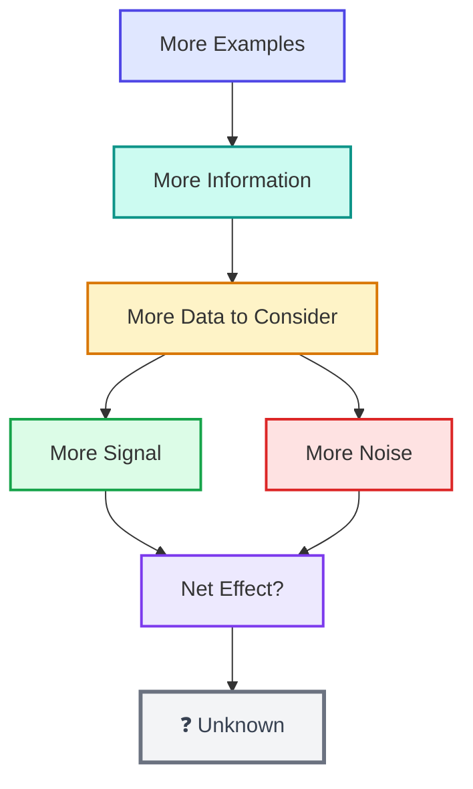
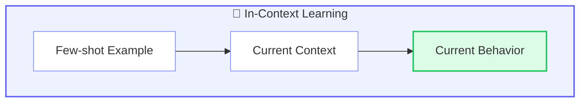
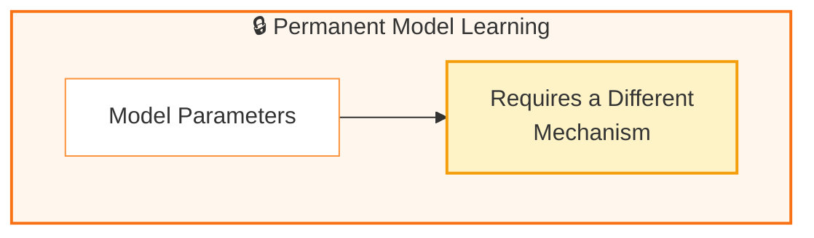
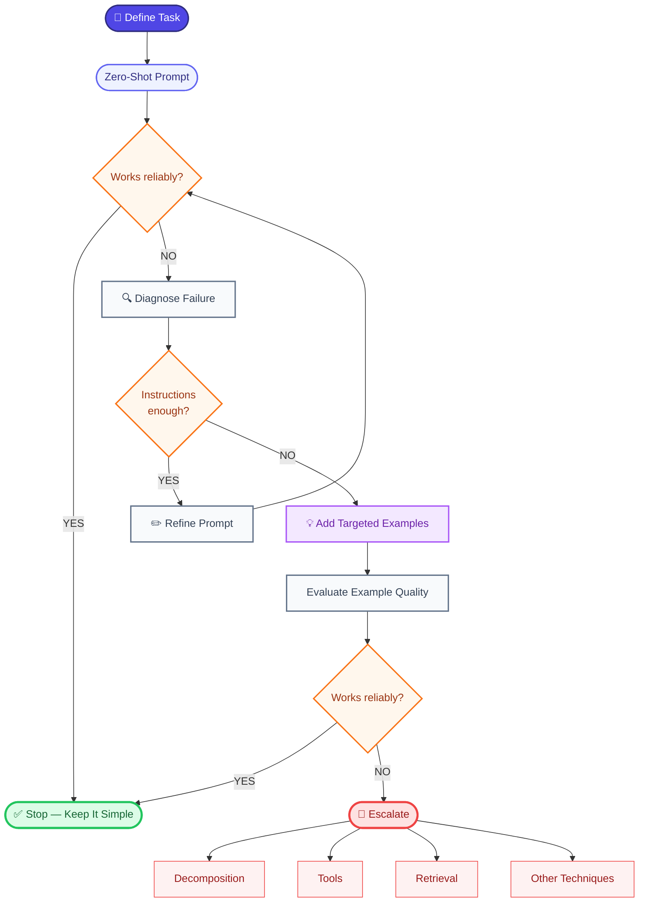
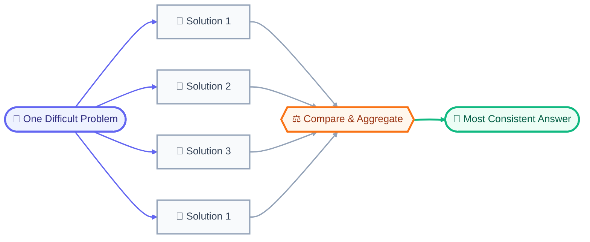
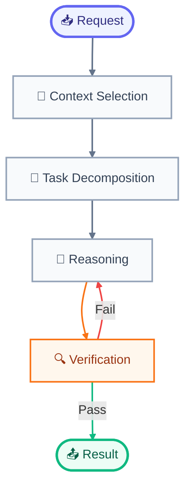

We now have a model for managing context: the application decides what the model should see, what should be retrieved, what should be summarized, and what should remain outside the immediate context.

The next question is more direct:

**Once the right information is in front of the model, how should we ask it to perform the task?**

There is no single prompting technique that wins everywhere. A useful progression is to start with the simplest instruction that works, then add examples or decomposition only when the task requires them.

### Zero-shot prompting

**Zero-shot prompting** means asking a model to perform a task without giving it examples of the desired behavior.

For our support application, a zero-shot prompt might be:

```plaintext
Summarize the following customer complaint in one sentence.
<complaint>
The package arrived three days late and the box was damaged.
</complaint>
```

There is no demonstration showing the model what a good summary looks like. The task is described directly.

This is the simplest prompting strategy, and it should usually be the starting point.

Why?

Because every additional component in a prompt has a cost. Examples consume context. More instructions increase complexity. More moving parts create more opportunities for contradictions.

If a clear instruction already produces reliable results, adding elaborate prompting machinery may solve a problem that does not exist.

#### Clear task specification

A useful task specification answers four basic questions:

1. **What should the model do?**
2. **What information should it use?**
3. **What constraints apply?**
4. **What should the output look like?**

For example:

```plaintext
Task:
Summarize the customer complaint.

Source:
<complaint>
The package arrived three days late and the box was damaged.
</complaint>

Constraints:
- Use only the information in the complaint.
- Do not infer the cause of the damage.
- Use one sentence.

Output:
Return only the summary.
```

This is longer than:

> _Summarize this._

But every additional instruction serves a purpose.

The model does not have to guess whether it should speculate about the cause, how long the answer should be, or whether it should include commentary.

Current prompting guidance from major model providers similarly emphasizes being explicit about the task, desired output, constraints, and relevant context rather than relying on implicit assumptions.

The principle is straightforward:

**If a requirement matters to the application, state it explicitly.**

#### Explicit objectives

“Be helpful” is a vague objective.

“Identify the customer’s stated problem and summarize it in one sentence” is much more concrete.

Consider our support application.

A weak instruction might be:

> Help the customer.

A stronger one is:

> Identify the authentication problem described by the customer and provide up to three troubleshooting steps supported by the supplied documentation.

The second instruction gives the model a target.

This matters because language models are capable of producing many plausible continuations. A broad objective leaves more room for the model to choose an interpretation that differs from what the application intended.

A precise objective narrows that space.

#### Constraints are part of the task

Suppose the support application should never invent a troubleshooting step that is absent from its documentation.

That is an application requirement, so it should appear explicitly:

> Use only the supplied documentation.  
> If the documentation does not contain enough information to answer the question, say that the available information is insufficient.

This is more useful than:

> Be accurate.

“Be accurate” expresses a desirable outcome. It does not tell the model how the application wants uncertainty handled.

A stronger prompt describes the desired behavior at the point where failure is likely.

This is a recurring pattern in prompt engineering:

**Do not merely describe the ideal result. Specify what the model should do when the ideal result cannot be produced safely or reliably.**

That becomes especially important for tool use and structured output later.

#### When zero-shot prompting works

Zero-shot prompting is often sufficient when:

- the task is straightforward,
- the desired behavior is easy to describe,
- the model already understands the task,
- the output requirements are simple,
- and the input does not contain unusual edge cases.

For example:

> Extract the customer's product version from this message.  
> Return the version number only.

There may be little benefit in supplying five examples.

The task is already clear.

Likewise:

> Translate this sentence into French.

usually does not need a demonstration.

The first optimization principle of prompting is therefore surprisingly conservative:

**Start with zero-shot. Add complexity only when evaluation shows that it is needed.**

#### Zero-shot failure modes

Zero-shot prompting can fail for several reasons.

1. **Ambiguous instructions**

Consider:

> Make this better.

Better in what sense?

Shorter? More persuasive? More accurate? More professional?

The model must infer the objective.

Compare:

> Rewrite the following support response so it is concise, professional, and understandable to a non-technical customer. Preserve all factual claims.

Now the task is much more constrained.

**2. Missing context**

A model cannot reliably use information it was never given or cannot retrieve.

If the support application asks:

> Why did this customer's authentication fail?

but supplies neither the error message nor relevant system information, a better prompt cannot manufacture the missing evidence.

This sounds obvious, but it is an important boundary of prompt engineering.

Sometimes the solution is not a better instruction.

It is **better context**.

**3. Conflicting requirements**

A prompt can also contain incompatible constraints:

> Give a complete explanation.  
> Use exactly ten words.

The model has to reconcile requirements that cannot both be satisfied well.

Good prompt architecture tries to prevent such conflicts rather than expecting the model to resolve every ambiguity correctly.

**4. Hidden assumptions**

A developer might expect:

> _“Summarize the complaint.”_

to mean:

> _“Extract only facts explicitly stated by the customer.”_

The model may instead produce a natural-language summary containing reasonable inferences.

If the distinction matters, the instruction should make it explicit.

This is another recurring principle:

**Human assumptions that matter to the system should become explicit machine-facing requirements.**

### Few-shot prompting

When zero-shot instructions are insufficient, the next tool is **few-shot prompting**.

Few-shot prompting provides examples of the task directly inside the model’s context.

For example:

```plaintext
Task:
Classify the customer message as BILLING, TECHNICAL, or ACCOUNT.

Example 1:"My invoice contains an unexpected charge."
→ BILLING

Example 2:"The application crashes when I upload a file."
→ TECHNICAL

Example 3:"I cannot reset my password."
→ ACCOUNT

Now classify:"I was charged twice for my subscription."
```

The model can infer the desired mapping from the demonstrations.

This is sometimes called **in-context learning** : the model adapts its behavior for the current task based on examples supplied in the context, without changing its underlying model parameters.

The examples effectively tell the model:

> _“Here is what this task looks like in practice.”_

That can communicate details that are difficult to express in prose.

#### Examples teach behavior, not just formatting

This is an important point.

Developers often think few-shot examples are mainly a formatting trick.

They are more powerful than that.

Consider:

> Input:  
> The customer says the application is slow.

> Output:  
> TECHNICAL

This example does not merely demonstrate the output format. It gives the model evidence about how the application interprets the category “TECHNICAL.”

The examples therefore influence the model’s understanding of the task itself.

This is why poor examples can be dangerous.

If your demonstrations contain inconsistent labels, accidental biases, or edge cases that contradict the intended policy, the model may reproduce those patterns.

#### Example selection

Suppose you have 10,000 historical support tickets.

You cannot necessarily place all 10,000 examples into the prompt.

You must select a subset.

A naïve approach might choose examples randomly.

A better approach might deliberately include representative cases:

```plaintext
Example 1: straightforward billing issue
Example 2: straightforward technical issue
Example 3: ambiguous issue
Example 4: boundary case
Example 5: short, poorly written request
```

The best selection strategy depends on the task.

For a classification problem, examples should cover the important classes and boundaries.

For a formatting task, examples should demonstrate the required structure.

For a reasoning-heavy task, examples might demonstrate how the task should be decomposed or verified.

The important idea is:

**Examples should be selected for information value, not merely because they are available.**

#### Number of examples

More examples are not automatically better.

Suppose one carefully chosen example makes the required behavior obvious.

Adding 30 more examples may consume thousands of tokens without improving performance.

Worse, additional examples may introduce inconsistent patterns.

So few-shot prompting has the same context-management problem we encountered earlier:



The right number should therefore be determined empirically.

This is where prompt engineering starts to resemble experimental engineering. Instead of asking:

> _“Does this prompt sound better?”_

we ask:

> _“Does this version perform better on representative test cases?”_

That distinction will become central when we reach evaluation.

#### Example diversity

Suppose every demonstration is a simple, perfectly written request.

The model may learn a narrow pattern:

> Short, clean request → expected output

But real users might produce:

```plaintext
"can't login"
"I've been locked out since yesterday"
"Password reset isn't sending me anything"
"login broken after changing phone"
```

These inputs express related problems in very different ways.

A useful few-shot set should therefore reflect the kinds of variation the application expects.

This does not mean adding examples randomly.

It means deliberately covering meaningful variation.

#### Positive and negative examples

Some tasks benefit from showing not only what to do, but what not to do.

For example:

```plaintext
Input:
    "The customer says the package arrived late."
Good output:
    "The customer reports that the package arrived late."
Bad output:
    "The courier lost the package."
Reason:
    The customer did not state that the courier lost it.
```

The negative example demonstrates an important boundary: do not infer unsupported facts.

However, negative examples must themselves be designed carefully. An example labeled “bad” can accidentally teach the model the very behavior you wanted to discourage, especially if the distinction is unclear.

So the application should test whether negative demonstrations actually improve behavior rather than assuming they will.

#### Formatting examples

Examples are particularly useful when the output structure is difficult to explain.

Suppose the application wants:

```plaintext
Issue: ...
Evidence: ...
Action: ...
```

A demonstration can make the expected structure immediately concrete:

```plaintext
Input:
    "The login token expired after 30 days."
Output:
    Issue: Expired authentication token
    Evidence: Token expiration is reported after 30 days
    Action: Regenerate the authentication token
```

The example establishes both the content pattern and the presentation pattern.

Later, when we discuss structured outputs, we will see that examples are not always the right solution. If software needs machine-readable JSON with guaranteed structural validity, a schema-constrained output mechanism can be stronger than merely showing the model a JSON example.

#### Consistency between examples

Few-shot prompts are particularly sensitive to inconsistency.

Imagine:

```plaintext
Example 1:
    "Can't log in" → ACCOUNT
Example 2:
    "Can't log in" → TECHNICAL
```

The model has no principled reason to know which mapping the application intends.

Even subtler inconsistencies can cause trouble.

If some examples use:

> BILLING

while others use:

> Billing issue

the application may accidentally make the output space ambiguous.

Examples should therefore be internally consistent in:

- labels
- formatting
- terminology
- level of detail
- interpretation of edge cases

The demonstrations are part of the specification.

Treat them accordingly.

### In-context learning

The broader concept behind few-shot prompting is in-context learning.

The model receives examples in its current context and changes its behavior for that interaction based on those examples.

Importantly, this does **not** mean that the model has permanently learned the examples.

Suppose our application sends:

```plaintext
Example:
    "Password reset email never arrived." → ACCOUNT
User:
    "I can't access my account."
```

The model can use the demonstration for the current request.

That does not automatically modify the model’s underlying parameters or permanently add the example to its knowledge.

This distinction mirrors the context-versus-memory distinction from the previous phase.





Fine-tuning, which changes model parameters using additional training, is one such mechanism. We will compare prompting and fine-tuning much later.

For now, few-shot prompting should be understood as **temporary task conditioning through context**.

### Choosing between zero-shot and few-shot

A practical decision process looks like this:



The critical step is **identify the failure pattern**.

If the model fails because the task is ambiguous, add clarity.

If it fails because it lacks information, improve context.

If it fails because it does not understand a subtle task convention, examples may help.

If it fails because the task requires exact arithmetic or database access, adding more prose to the prompt may be the wrong solution entirely.

That last point prepares us for the next phase of prompting techniques.

Some tasks are simply too complicated to solve reliably with one instruction and one model response. They need to be decomposed into smaller operations, verified, or connected to external computation.

That is where **reasoning-oriented prompting** & **task decomposition** enter.

Once a prompt becomes more than a simple question, the main challenge changes. You are no longer trying to find the perfect sentence. You are designing a small procedure for the model to follow.

For the customer-support system we’ve been building, a request such as:

> _“The customer cannot log in after changing their password. Read the case history, determine the likely cause, and draft a response.”_

looks like one task. Operationally, it contains several:

1. determine what happened,
2. identify the relevant evidence,
3. distinguish facts from assumptions,
4. reason about possible causes,
5. decide what can safely be recommended,
6. check the recommendation,
7. produce the required response.

That distinction leads to one of the most useful ideas in advanced prompting: **decomposition**.

### Breaking a complex task into subtasks

Prompt decomposition means turning one complicated task into several smaller tasks with explicit boundaries.

Instead of asking the model to solve everything at once, the application can structure the request roughly as:

```plaintext
Task:
Analyze this customer support case.

Step 1:
Extract the relevant facts.

Step 2:
Identify the customer's actual problem.

Step 3:
List plausible causes supported by the evidence.

Step 4:
Select the safest supported resolution.

Step 5:
Draft the customer-facing response.
```

The point is not that the model literally needs to see the word “Step.” The useful part is that the problem has been converted from an ambiguous goal into a sequence of more manageable operations.

This is especially valuable when different parts of the task have different requirements. Extracting facts is primarily an information task. Selecting a diagnosis involves reasoning. Drafting the final message is a communication task. Treating all three as one undifferentiated instruction makes it harder to control and evaluate the result.

A decomposed system also gives you more places to test the output. If the final answer is wrong, you can ask whether the problem was incorrect fact extraction, bad diagnosis, or poor response generation.

That is a major shift in mindset: **a prompt can be designed like a pipeline, not merely written like a question.**

### Planning before answering

A related technique is to ask the model to establish a plan before carrying out a complex task.

Planning is useful when the model needs to decide _what operations are necessary_ before it can produce the answer. For example, our support application might first establish:

```plaintext
Goal:
Resolve the customer's login problem using only supported evidence.
Plan:
1. Read the latest customer message.
2. Check the relevant conversation history.
3. Identify authentication-related evidence.
4. Compare the evidence with the known troubleshooting guidance.
5. Produce a response that does not claim unsupported facts.
```

Planning separates **deciding how to solve the problem** from **executing the solution**.

That separation becomes even more important once a system has external tools. A model might need to decide that it should search a knowledge base, inspect an account record, or calculate something before it can answer. Tool use will become a major part of this article later; for now, the important lesson is that prompting can establish the structure of the work before the work itself happens.

There is a trade-off. Decomposition adds prompt length, model calls, and latency if each step is implemented as a separate call. A five-step pipeline can therefore cost substantially more than one call. Decomposition is useful when the additional control and reliability are worth that cost, not because more steps are inherently better.

### Critique and revision

Another powerful pattern is **generate, critique, revise**.

Instead of treating the first answer as final, the system gives the model a second opportunity to inspect its own proposed answer against explicit criteria.

For our support system:

```plaintext
First:
Draft the response.

Then:
Check the draft for:
- unsupported claims,
- missing evidence,
- incorrect troubleshooting steps,
- promises the support team cannot make,
- failure to answer the customer's actual question.

Finally:
Revise the response to correct any problems.
```

This works because generation and evaluation are different jobs.

A model producing an answer has to construct something plausible. A model reviewing an existing answer can instead look for violations of a checklist. Making those criteria explicit is often more useful than simply saying “think harder.”

The same pattern can be applied at different levels:

**Draft → review → final response**

or, for a more structured task:

**Extract → verify extraction → classify → verify classification → generate**

The second version is easier to debug because each stage has a defined contract.

There is an important limitation, though: **a model is not an independent source of truth merely because it is asked to critique itself**. If the original answer contains a false assumption, the critic may share that assumption. Self-critique can therefore improve consistency without guaranteeing correctness.

For high-stakes decisions, verification against something outside the model becomes more valuable. That might be a database, a known rule, a calculation, a retrieved document, or deterministic software. We will return to that distinction when we reach tool use and evaluation.

### Reasoning-oriented prompting

The research on **chain-of-thought prompting** showed that giving a language model examples containing intermediate reasoning steps can improve performance on some multi-step reasoning tasks. The original work demonstrated improvements across arithmetic, commonsense, and symbolic reasoning benchmarks.

The important engineering idea is broader than the phrase “chain of thought.”

A complex task may benefit when the prompt makes its intermediate structure explicit:

```plaintext
Identify the relevant facts.
Determine which facts support each possible conclusion.
Eliminate conclusions that require unsupported assumptions.
Select the conclusion supported by the evidence.
```

This is **reasoning-oriented prompting** : designing the task so that intermediate decisions are explicit enough to guide the model toward the required result.

It does not mean that a production application must expose a model’s private internal reasoning to the user. In fact, a better interface is often to request the _result of verification_ rather than a long hidden-looking explanation.

For example, instead of requiring the customer-facing system to emit its entire reasoning process, the application can require an internal structured result such as:

```plaintext
classification: password_reset_issue
evidence_supported: true
recommended_action: resend_reset_link
confidence: high
```

and then separately generate a concise customer response.

That separation matters because **reasoning structure and user-facing explanation are different requirements**.

It also prevents a common prompting mistake: assuming that asking for more visible reasoning automatically makes an answer more reliable. Intermediate reasoning can contain mistakes too. Research examining chain-of-thought prompting has found that some properties of the demonstrations, such as relevance and ordering, matter substantially, which reinforces the point that merely adding long rationales is not a universal solution.

### Self-consistency: don’t trust a single path blindly

Language-model generation is probabilistic, so the model can sometimes reach different answers from the same underlying problem.

**Self-consistency** takes advantage of this by generating multiple candidate reasoning paths and selecting the answer that is most consistently supported across those paths rather than relying on one sampled path.

Conceptually:



Suppose our support system is uncertain whether a case represents a password-reset problem or an account-lockout problem. Instead of accepting one generated classification, it could produce several candidate analyses and compare their resulting classifications.

But self-consistency is not the same as truth.

If the model systematically misunderstands the underlying situation, several independent generations can agree on the same wrong answer. Agreement is evidence of consistency, not proof of correctness.

There is also a practical cost: multiple generations consume more computation and increase latency. That makes self-consistency most attractive when the task is difficult enough that the reliability improvement justifies the additional cost.

### When prompting should stop and computation should begin

This is the boundary that separates increasingly elaborate prompts from good system design.

Consider a user asking:

> _“The customer’s invoice contains 17 items at ₹1500 each. What is the total?”_

A language model can probably perform the arithmetic. But if the application needs an exact financial total, there is little reason to make the model _simulate_ arithmetic through increasingly elaborate instructions.

A calculator or ordinary program can perform the multiplication deterministically.

The same principle applies to other tasks:

- **Database lookup:** query the database rather than asking the model to remember account data.
- **Current information:** retrieve the information rather than relying on model knowledge.
- **Arithmetic:** use a calculator or program.
- **Schema validation:** use a parser and validator.
- **Authorization:** use application code and access-control rules.
- **Business rules:** encode critical rules deterministically where practical.

This leads to a useful rule:

> **_Use prompting to control language-model behavior; use deterministic software when deterministic computation or enforcement is what the task actually requires._**

The distinction becomes even sharper with external actions. ReAct, a well-known research approach, explored interleaving reasoning with actions so that a model could use external sources or environments rather than relying entirely on its internal knowledge. The work demonstrated that interaction with external information can help address problems such as hallucination and error propagation in some tasks.

That is the conceptual bridge to the next phase of this article.

Our support system has started as a prompt. It now looks more like a small program:



And once verification requires a database, knowledge base, API, or another external capability, the model is no longer operating on text alone.

That is where **context engineering** begins: deciding not just what instructions to write, but what information the model should receive, in what order, in what form, and for what purpose.
