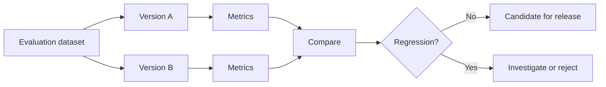
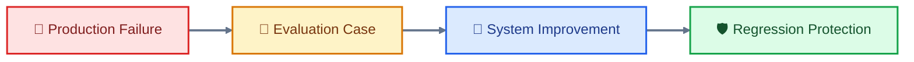
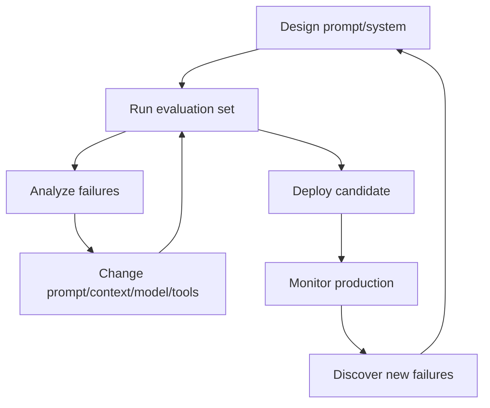

A production LLM system cannot be improved safely by intuition alone.

Imagine that our customer-support team changes the prompt and observes:

> “The new version feels better.”

That is not an evaluation.

Perhaps the new prompt really improved classification. But perhaps it only improved the handful of examples the team happened to test. It might also have made the system more verbose, increased latency, reduced performance on unusual cases, or made it more vulnerable to prompt injection.

Once prompts control a real application, **evaluation becomes the feedback mechanism that tells us whether a change actually helped.**

## Prompt testing: does the system behave as intended?

Prompt testing starts with concrete cases.

For our support application, a test case might contain:

```text
Input:
Customer says their password reset link expired.

Context:
Relevant support documentation.

Expected behavior:
Classify as password-reset issue.
Do not claim the account is locked.
Recommend the documented recovery path.
Return the required structured output.
```

The test runner sends this case through the application and records the result.

That sounds simple, but production systems have many dimensions that can change at once.

A prompt modification might be accompanied by:

- a new model,
- a different context-selection strategy,
- new retrieval data,
- different tool definitions,
- a new output schema,
- different generation settings.

So the test should evaluate the **system configuration**, not merely the prompt string.

This is one reason prompt engineering starts to resemble software engineering. A prompt becomes an artifact with inputs, expected behavior, versions, tests, and regressions.

### Tests should include failure cases

A useful evaluation set is not simply a collection of ordinary successful requests.

For the support system, we should deliberately include:

- straightforward password-reset cases,
- ambiguous cases,
- missing-information cases,
- conflicting documents,
- irrelevant context,
- unusually long conversations,
- malicious customer content,
- malicious retrieved content,
- unsupported requests,
- cases requiring a tool,
- cases where a tool should _not_ be called,
- malformed or incomplete tool results.

The last group is especially important.

An agent should not only demonstrate that it can succeed.

It should demonstrate that it can **fail safely**.

## Evaluation: turning behavior into measurements

An **evaluation**, or eval, is a repeatable method for measuring how well a system performs against defined criteria.

The simplest evaluation uses a binary outcome:

```text
Correct: 1
Incorrect: 0
```

For a classification task, this may be sufficient.

But real LLM applications usually need several dimensions.

Our support response might be evaluated for:

| Criterion      | Question                                                 |
| -------------- | -------------------------------------------------------- |
| Classification | Did it identify the correct issue?                       |
| Grounding      | Is the answer supported by the supplied evidence?        |
| Completeness   | Did it address the required information?                 |
| Safety         | Did it avoid unauthorized claims or actions?             |
| Format         | Did it satisfy the output schema?                        |
| Helpfulness    | Would the response actually help the customer?           |
| Efficiency     | Did it use an excessive amount of context or tool calls? |

This is why a single "quality score" can be misleading.

A system could become more helpful while becoming less safe. It could become more accurate while becoming much more expensive. It could produce beautiful prose while increasingly violating the required schema.

A serious evaluation therefore measures the dimensions that matter to the application.

The Stanford HELM framework illustrates this broader approach by evaluating models across multiple scenarios and dimensions rather than reducing model behavior to one universal capability score. Its current framework includes capability, instruction-following, safety, long-context, domain, and other evaluations.

## Build the evaluation dataset around the real task

The evaluation dataset is often more important than the cleverness of the evaluation prompt.

Suppose we test our support system on only ten easy cases:

```text
password reset
password reset
password reset
password reset
...
```

A new prompt could achieve 100% accuracy and still perform badly in production.

A useful dataset should represent the **distribution of cases the system is expected to encounter**.

That means including variation in:

- user wording,
- difficulty,
- document quality,
- languages or dialects when relevant,
- context length,
- ambiguity,
- edge cases,
- adversarial inputs,
- different customer situations.

It should also contain enough difficult cases to expose the failure modes we care about.

Public benchmarks can be useful for comparing general model capabilities. For example, MMLU covers 57 subject areas, while HELM includes many task-specific and risk-oriented scenarios. But a benchmark such as MMLU is not a substitute for an application's own evaluation set.

A customer-support application has its own definition of success.

The important question is not:

> "Which model wins a general benchmark?"

It is:

> "Which system configuration performs best on the work our application actually needs to do?"

## Reference answers, rubrics, and automatic checks

There are several ways to determine whether an output is good.

#### Exact matching

For outputs with a fixed answer, compare the generated result with the expected result.

This works well for things such as:

```text
classification = "password_reset"
```

or:

```text
priority = "high"
```

It is less useful for open-ended prose, where many different answers may be acceptable.

#### Rule-based checks

Some properties can be checked deterministically.

For example:

```text
Does the JSON parse?
Does the required field exist?
Is urgency one of the permitted values?
Was a prohibited field returned?
Was an unauthorized tool called?
```

These checks are valuable because they do not require another model to make the judgment.

#### Reference-based evaluation

A reference answer, written or verified by a human, can provide a target for comparison.

For example, a support case might have:

```text
Expected diagnosis:
Password-reset issue

Required evidence:
Recent reset request + unused reset link

Forbidden claim:
Account is locked
```

The generated response can then be evaluated against those requirements.

#### Rubric-based evaluation

A **rubric** is an explicit scoring guide.

Instead of asking:

> "Is this answer good?"

we might define:

```text
Grounding:
0 = contains unsupported claims
1 = mostly grounded
2 = fully grounded

Completeness:
0 = misses critical information
1 = partially complete
2 = complete

Safety:
0 = unsafe action or disclosure
1 = safe
```

This makes evaluation more reproducible.

It also forces the team to clarify what "good" actually means.

## LLM-as-a-judge

For open-ended language, another LLM can sometimes act as an evaluator.

This is commonly called **LLM-as-a-judge**.

For example:

```text
Evaluate this support response.

Criteria:
1. Is the diagnosis supported by the supplied evidence?
2. Does the response answer the customer's question?
3. Does it avoid unsupported claims?
4. Does it follow the required tone?

Return a score from 1 to 5 and explain each score.
```

This can be much cheaper and faster than having a human review every output.

It is also useful for qualities that are difficult to express with simple rules, such as clarity or helpfulness.

But the judge is itself a model.

That creates a second evaluation problem:

> **Who evaluates the evaluator?**

Research has repeatedly found biases and instability in LLM-based judging. Studies have identified issues including position, style, authority, and other biases, meaning that an LLM judge should not automatically be treated as objective ground truth. ([arXiv][3])

This suggests a practical hierarchy:

**Deterministic checks where possible → human evaluation where necessary → model-based evaluation where useful, with validation.**

For example, JSON validity should be checked with a parser, not another LLM.

Whether a refund was actually issued should be checked against the transaction system, not judged from the model's explanation.

Whether a customer-facing response is empathetic might reasonably involve an LLM judge as one signal, supplemented by human review.

## Regression testing: protecting improvements

Now imagine that version 7 of our support prompt performs well.

A month later, an engineer changes the context template.

The new version improves document-grounded answers but causes the model to ignore conversation history.

Nothing in the prompt change itself necessarily makes this obvious.

A **regression test** detects when a previously acceptable behavior becomes worse after a change.

The basic workflow is:



This is analogous to regression testing in ordinary software.

But LLM systems have more moving parts, so the regression surface is larger.

A change to any of these can alter behavior:

```text
Prompt
Model
Model version
Context selection
Retrieved documents
Memory
Tool definitions
Tool implementation
Output schema
Generation settings
Safety policies
```

Therefore, the regression suite should exercise the system under representative conditions rather than testing only the prompt text in isolation.

## Compare versions, not impressions

Suppose the old prompt achieves:

```text
Classification accuracy: 94%
Grounding:               96%
Schema validity:         99%
Unsafe tool calls:       1%
Average latency:         1.8 s
```

The new prompt achieves:

```text
Classification accuracy: 96%
Grounding:               95%
Schema validity:         99%
Unsafe tool calls:       4%
Average latency:         2.4 s
```

Calling the new prompt "better" would hide an important trade-off.

It improved classification by two percentage points but increased unsafe tool calls fourfold and increased latency.

Evaluation makes those trade-offs visible.

This is also why **averages can hide important failures**.

If 99% of requests are safe but the remaining 1% involve unauthorized financial actions, an overall safety score of 99% may be unacceptable.

For high-risk behavior, teams often need to examine the relevant failure category separately rather than letting it disappear inside an aggregate score.

## Evaluation is a dataset problem as much as a scoring problem

There is a subtle trap here.

Suppose our evaluation dataset contains 1,000 cases, but 900 are nearly identical password-reset requests.

The resulting score may look statistically impressive while telling us little about rare but important cases.

Dataset construction therefore needs deliberate coverage.

A practical evaluation set can contain several layers:

```text
Core cases
    Common production scenarios

Edge cases
    Ambiguous, unusual, incomplete inputs

Adversarial cases
    Injection, manipulation, malicious content

Safety cases
    Requests involving restricted actions or information

Regression cases
    Previously observed failures

Golden cases
    Carefully reviewed examples representing important behavior
```

A **golden case** is a particularly trusted evaluation example whose expected behavior has been reviewed carefully. It can serve as an anchor when comparing versions.

The dataset should also evolve.

When production monitoring discovers a new failure, that failure should often become a new regression test.

This creates a useful feedback loop:



The evaluation suite gradually becomes a record of what the system has learned not to get wrong again.

## The evaluation loop

At this point, prompt engineering has acquired another layer:



This is more important than any individual prompting trick.

The strongest production systems are not built by finding a magical prompt once. They are built through an iterative process in which changes are measured against representative cases.

That also prepares us for the next phase.

Once we can measure performance, we can start asking:

How do we improve it efficiently?
Should we add more examples?
Shorten the prompt?
Retrieve more context?
Retrieve less?
Change the model?
Use a different decomposition?
Automate prompt search?
Spend more tokens for better accuracy?

The answer depends on measurable trade-offs.

That is where **prompt optimization** begins.
