Evaluation gives us something prompting alone cannot: a way to measure change.

Now we can ask a much more useful question than "What wording sounds better?"

> **What change produces the best system behavior for the constraints we actually care about?**

That is **prompt optimization**.

Optimization does not necessarily mean making a prompt longer, more sophisticated, or more clever. It means systematically searching for a better configuration of instructions, examples, context, model, and workflow according to a defined objective.

## Manual optimization: change one thing, measure it

The simplest optimization loop is still performed by a human.

Suppose our customer-support system currently has this instruction:

```text
Classify the customer's issue and provide a helpful response.
```

The evaluation shows that the model frequently invents diagnoses when the evidence is incomplete.

A human might revise it:

```text
Classify the customer's issue using only the supplied evidence.

If the evidence is insufficient to determine the cause,
say that the cause is uncertain rather than inventing one.

Then provide the safest supported next step.
```

Run the evaluation again.

If grounding improves without unacceptable regressions, keep the change. If not, investigate and try another change.

This sounds almost trivial, but the discipline matters:

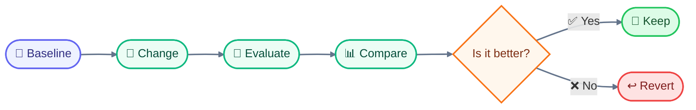

Without the evaluation step, optimization becomes guesswork.

### Optimize the whole system, not just wording

The next important realization is that the prompt itself may not be the best thing to optimize.

Suppose our evaluation reveals:

> The model often gives incorrect answers because the relevant product documentation is missing from the context.

We could spend hours rewriting the instruction:

> "Please carefully use all available information..."

But that does not solve the actual problem.

A better change might be:

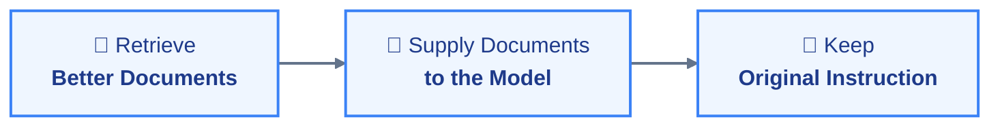

Likewise:

- If output formatting fails, use structured output or validation.
- If the model lacks current information, improve retrieval.
- If arithmetic is wrong, use a calculator.
- If a task is too difficult for the current model, try a stronger model.
- If repeated context is expensive, use caching or context compression.
- If a tool is repeatedly misused, improve the tool interface or authorization layer.

This is why optimization belongs after context engineering, tool use, and evaluation in our progression.

The thing being optimized is increasingly **the system configuration**, not a sentence.

## Prompt length is not a quality metric

A common optimization mistake is assuming that more instructions must produce better behavior.

Sometimes they do.

Sometimes they simply make the context harder to navigate.

Suppose the support prompt grows from:

```text
Classify the issue using the supplied evidence.
```

to several pages containing every rule the team has ever written.

The second prompt may contain more information but still perform worse because relevant instructions are buried among redundant or conflicting material.

Context itself has a cost.

Longer inputs can increase token usage and latency, and additional context can sometimes distract from the information that actually matters. Our earlier discussion of long-context behavior is therefore directly relevant to optimization.

The goal is not:

> **maximize prompt information**

but:

> **maximize useful information per unit of cost and complexity.**

Recent research on economical prompting makes the same broader point: techniques should be compared using more than accuracy alone, because additional reasoning or sampling can consume substantially more tokens and computation.

## The optimization objective needs more than one number

Imagine two versions of our support system:

| Metric                    | Version A | Version B |
| ------------------------- | --------: | --------: |
| Correct classification    |       94% |       97% |
| Grounded responses        |       96% |       95% |
| Invalid structured output |      0.5% |      0.8% |
| Unsafe tool calls         |      0.2% |      1.0% |
| Average latency           |     1.2 s |     2.1 s |
| Relative cost             |        1× |      2.4× |

Which is better?

There is no universal answer.

For a low-risk internal assistant, Version B might be attractive.

For a system that can modify customer accounts, the increase in unsafe tool calls could make Version A preferable.

For a high-volume application, the cost difference might dominate.

This is a **multi-objective optimization** problem: several goals must be considered simultaneously rather than collapsing everything into accuracy.

Typical objectives include:

- accuracy,
- grounding,
- safety,
- latency,
- token usage,
- monetary cost,
- tool-call count,
- output quality,
- reliability,
- maintainability.

The right optimization target comes from the application's requirements.

## Automated prompt optimization

Once the evaluation loop exists, humans do not necessarily need to generate every candidate prompt manually.

An automated optimizer can generate alternatives, evaluate them, and continue searching.

Conceptually:

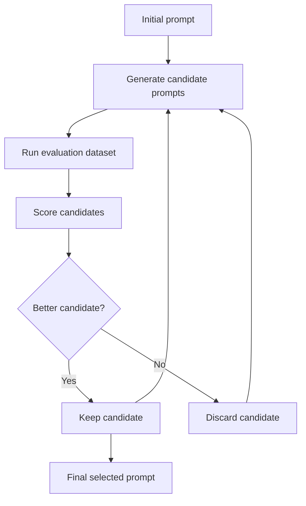

One research direction is **Optimization by PROmpting (OPRO)**, where an LLM itself proposes new solutions based on previous candidates and their measured scores. The researchers applied this idea to prompt optimization and reported improvements over human-designed prompts on several benchmark tasks.

The important idea is not that OPRO produces a universally superior prompt.

It is that prompt design can become a **search problem**.

Instead of:

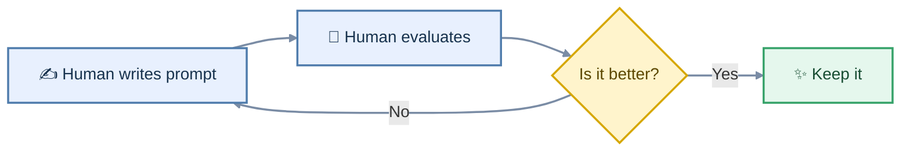

we can have:

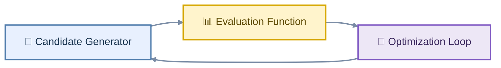

The evaluation function becomes the source of feedback.

That makes the quality of the evaluation dataset extremely important. If the dataset is poor, automated optimization can efficiently find a prompt that performs well on the wrong objective.

## Optimizing examples as well as instructions

A prompt is often made of more than instructions.

It may also contain few-shot examples.

Suppose the support classifier uses examples like:

```text
Example 1:
"Reset link expired."
> password_reset

Example 2:
"Too many failed attempts."
> account_lockout

Example 3:
"I forgot my password."
> password_reset
```

Which examples should be included?

An optimizer can search not only for better wording, but for:

- which examples to include,
- how many examples to include,
- their ordering,
- how they are formatted,
- which examples best cover difficult cases.

This is important because examples consume context space.

An additional example may improve accuracy while increasing cost and potentially introducing an irrelevant or misleading pattern.

So even few-shot prompting becomes an optimization problem:

**Which examples provide the most useful signal for the least context cost?**

## Programmatic optimization: optimize the pipeline

A more ambitious direction is to stop treating prompts as isolated strings altogether.

Instead, represent the application as a program with components such as:

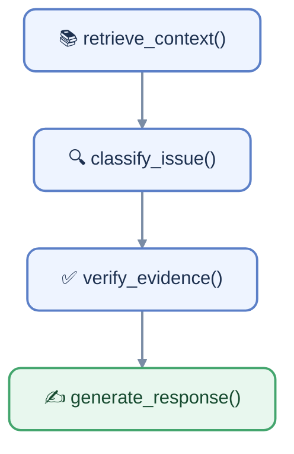

Each model call has a role and an evaluation criterion.

The optimizer can then search over instructions, demonstrations, and even aspects of the pipeline.

**DSPy** is an influential example of this approach. It represents language-model applications as composable programs rather than collections of manually tuned prompt strings, then uses optimization procedures to improve those programs against a chosen metric. The published work demonstrated optimization across tasks involving reasoning, retrieval, question answering, and agent loops.

This is a significant conceptual shift:

> **Instead of programming the exact prompt, specify what the system should accomplish and optimize the language-model components against that objective.**

It does not eliminate prompt engineering. It makes prompt engineering one parameter inside a larger optimization process.

## Optimization can overfit

There is a dangerous side effect of automated optimization: **overfitting**.

In machine learning, overfitting occurs when a system becomes very good at the examples used during optimization but performs worse on new examples.

The same thing can happen with prompts.

Suppose our optimizer evaluates 500 support cases repeatedly. Eventually it discovers wording that performs extremely well on those cases.

We might celebrate:

> "Accuracy increased from 92% to 98%."

But if the same prompt falls to 88% on new production cases, we have optimized the evaluation set rather than the actual task.

The solution is familiar from machine learning:

**separate optimization data from validation data.**

For example:

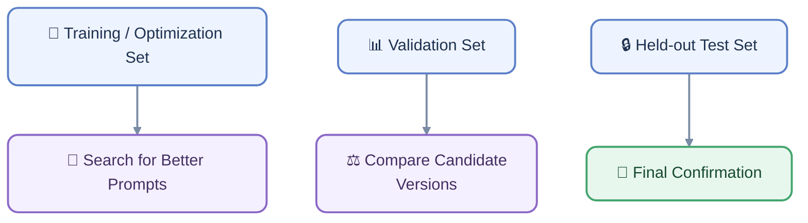

The precise split depends on the application, but the principle is essential:

> **Do not repeatedly optimize against the same small set and then treat that score as evidence of generalization.**

This is one reason the evaluation dataset must be representative and carefully managed.

## Cost, latency, and complexity are part of optimization

Consider three possible strategies for our support application.

### Strategy A: one model call


Cheap and fast.

### Strategy B: decomposition plus verification


Potentially more reliable, but more expensive and slower.

### Strategy C: multiple candidate generations

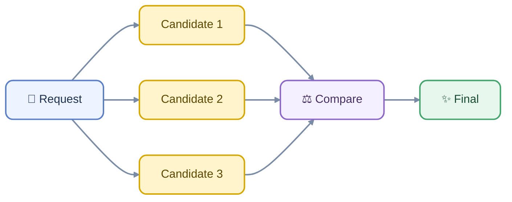

Potentially useful for difficult reasoning, but it multiplies inference work.

None is automatically superior.

A 2% accuracy improvement may be worthwhile if the task is high-value.

It may be wasteful if the application handles millions of low-risk requests.

Recent work on economical prompting reinforces this point by explicitly examining the relationship between prompting techniques, accuracy, and token consumption rather than treating accuracy as the only objective.

Optimization therefore needs a target such as:

> Maximize grounded accuracy subject to a latency budget and a maximum cost per request.

That is a much more meaningful engineering objective than:

> Make the prompt as accurate as possible.

## The optimization hierarchy

There is a useful order to try when a system underperforms.

Start with the simplest intervention that could plausibly solve the problem.

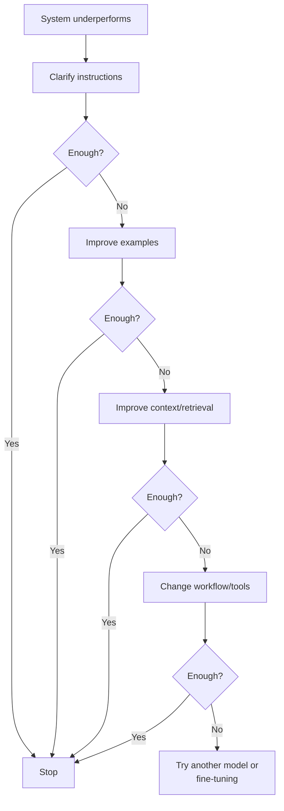

This is not a rigid law. Sometimes changing the model should happen early. Sometimes retrieval is obviously the bottleneck.

The underlying principle is simpler:

**Diagnose the failure before optimizing the wrong component.**

If the model has insufficient information, rewriting instructions is unlikely to solve the problem.

If the model has the right information but consistently produces malformed data, structured output may be more appropriate than additional prose instructions.

If the task is inherently deterministic, external computation may be better than any prompt optimization.

That distinction will become increasingly important as we move into production engineering.

At this point, our system has gone through a substantial evolution:


The next question is what happens when this system is no longer an experiment.

When a prompt has customers depending on it, the team needs to know:

- Which version is running?
- What changed?
- How often does it fail?
- Which model produced the output?
- Which context was supplied?
- Which tools were called?
- What did the user actually experience?
- Can we reproduce the failure?
- Can we roll back safely?

That is the beginning of **production prompt engineering**.

---

Once a prompt becomes part of a real application, changing it is no longer just editing text. A production prompt can influence thousands of requests, tool calls, customer-facing responses, costs, latency, and safety behavior. That makes the prompt a software artifact: something that needs an identity, a history, tests, monitoring, and a controlled way to move between environments.

## Prompt Versioning: Treat Prompts as Deployable Artifacts

Imagine our customer-support application has reached a stable state. Its main response prompt has been tuned through the evaluation process. Someone now proposes a small change:

> "When the retrieved documentation does not contain enough evidence, explicitly say that the information is unavailable instead of guessing."

The wording looks harmless. But we cannot assume the change is harmless. It might reduce unsupported answers while accidentally making legitimate answers more cautious. It might also interact differently with a newer model version or with the application's retrieval system.

The first production rule is therefore simple:

**Never silently replace a production prompt. Create a new version.**

Prompt versioning means giving each meaningful prompt revision its own identifiable history. A useful version record contains more than the prompt text itself:

- prompt name or identifier
- immutable version number or commit identifier
- the actual template
- author and timestamp
- description of what changed and why
- model and model configuration used during evaluation
- evaluation results
- environment or deployment status
- related application version
- potentially the versions of retrieval, tools, or other dependencies

A **prompt registry** is a system designed to store and manage these versions centrally. Modern prompt registries commonly provide immutable versions, diffs, metadata, evaluation integration, and aliases such as development, staging, or production.

Immutability matters. If version 17 means one particular prompt, changing its contents later destroys the meaning of every historical evaluation or production trace that says it used version 17. A safer design is:

```text
never changes
    support-response-v17

new wording
    support-response-v18
```

This is similar to source-code version control, but prompts have an additional complication: **the same prompt does not guarantee the same output**. Model behavior can be probabilistic, and the surrounding context can change. Prompt versioning therefore gives us reproducibility of the _configuration_, not a guarantee of identical text every time. Current prompt-management systems explicitly associate prompt versions with runs, models, and other metadata for this reason.

### Version the prompt, but also version its surroundings

Consider this production trace:

```text
Prompt: support-response-v17
Model: model-A
Application: support-app-3.4
Retriever: product-search-v8
Tool definitions: account-tools-v3
```

That record is much more useful than:

```text
Prompt: "You are a helpful support agent..."
```

Why? Because an LLM application's behavior comes from a system, not from the prompt string alone.

Suppose the team reports that answers became less accurate on Tuesday. If the prompt version stayed at v17, that does not prove the prompt was uninvolved. The model may have changed. Retrieved documents may have changed. The application may have changed how it constructs context. A tool may have returned different data.

This is why production systems increasingly track **lineage**, meaning the relationships between a result and the versions of the components that produced it. Prompt registries can link prompt versions to application runs and models specifically to make this kind of debugging possible.

For our support application, a safe deployment might therefore look like:

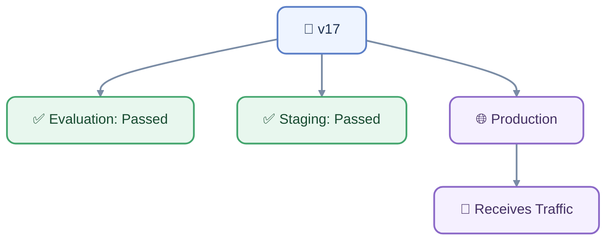

A proposed v18 follows a separate path:

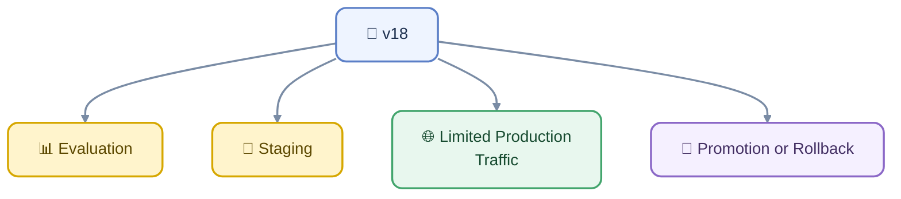

An **alias** is a mutable name that points to a particular immutable version. For example, `production` might currently point to v17. Moving the alias to v18 changes what production loads without changing what v17 means. This pattern is useful for controlled promotion and rollback.

That distinction gives us two useful concepts:

**Version = what the artifact is.**

**Alias/environment = where that artifact is currently being used.**

This is much safer than hard-coding a single prompt string throughout an application.

## Prompt Observability: Seeing What the System Actually Did

Versioning tells us **which configuration we intended to run**. Observability tells us **what happened when it ran**.

**Observability** is the ability to understand a system's internal behavior from the information it records about its execution. In conventional software this commonly involves logs, metrics, and traces. In LLM applications, those signals need additional information about model calls, prompts, generated outputs, retrieval, tools, and token usage.

This matters because an LLM application can fail in ways that are invisible from its final answer.

Our support application might produce:

> "I couldn't find the requested information."

That single sentence does not tell us whether:

1. the prompt was wrong,
2. retrieval found nothing,
3. retrieval found the right document but it was omitted from the context,
4. the model ignored the evidence,
5. a tool call failed,
6. the model exceeded a context budget,
7. a timeout triggered a fallback,
8. the application used the wrong prompt version.

A **trace** solves part of this problem by recording the sequence of operations belonging to a request.

For example:

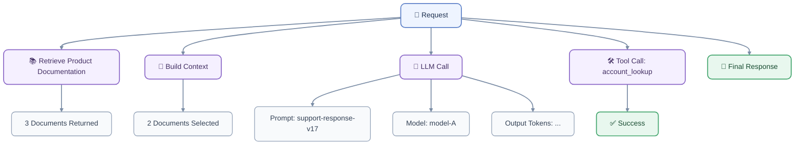

Now the team can ask much more precise questions.

Was retrieval slow? Look at the retrieval span.

Did the model consume an unexpectedly large context? Look at token usage.

Did the tool fail? Look at the tool span.

Did a new prompt version cause quality to fall? Group traces by prompt version and compare evaluation or production outcomes.

OpenTelemetry, an open standard for collecting telemetry, defines common names for operations and attributes so that different tools can record and interpret telemetry consistently. Its current generative-AI conventions include information such as input and output token counts and workflow-related metadata.

For an LLM application, useful observability data can include:

| Signal                 | What it helps answer                  |
| ---------------------- | ------------------------------------- |
| Prompt version         | Which instructions were active?       |
| Model/version          | Which model produced the result?      |
| Application version    | Which code constructed the request?   |
| Input/output tokens    | How large and expensive was the call? |
| Latency                | Where did time go?                    |
| Retrieved document IDs | What information reached the model?   |
| Tool calls             | What external actions occurred?       |
| Tool results/status    | Did those actions succeed?            |
| Evaluation scores      | Did quality change?                   |
| Errors/retries         | What failed operationally?            |

But there is an important security boundary here.

**Do not automatically log everything.**

A support application's traces could contain customer names, account details, private messages, uploaded documents, or other sensitive information. Observability can therefore become a second data-exposure channel if logs are treated casually.

The team may need to redact sensitive fields, restrict access, limit retention, encrypt stored telemetry, and decide deliberately whether full prompt and completion content should be captured at all. OpenTelemetry's GenAI guidance explicitly distinguishes telemetry such as model and token information from optional recording of full prompt, completion, tool-call, and tool-result content.

The principle is the same one established in the security section:

> **Visibility must not bypass the application's security boundaries.**

---

## The Prompt Lifecycle: From Idea to Rollback

With versioning and observability in place, prompt engineering becomes a lifecycle rather than a sequence of ad hoc edits.

A practical lifecycle is:

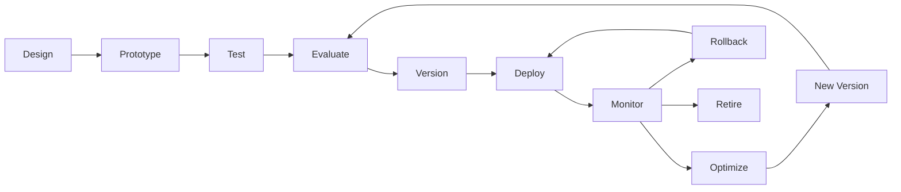

Each stage answers a different question.

**Design:** What should the system do?

**Prototype:** Can a plausible prompt achieve it?

**Test:** Does it behave correctly on representative and adversarial cases?

**Evaluate:** Is the change actually better according to measurable criteria?

**Version:** Can we identify and reproduce the exact artifact being deployed?

**Deploy:** Can we introduce the change without losing control of the previous version?

**Monitor:** What happens under real traffic?

**Optimize:** Where should the next improvement come from?

**Rollback:** Can we quickly return to a known-good configuration?

**Retire:** Is an old prompt no longer needed, or should it be preserved for audit and historical analysis?

This is where production prompt engineering starts to look much more like software engineering than copywriting.

### Deployment should be gradual when the risk justifies it

A new prompt does not necessarily need to go from zero users to every user immediately.

One strategy is a **canary deployment**, where a new version receives a small portion of production traffic before wider release. Another is an **A/B test**, where different variants are deliberately exposed to different traffic so their outcomes can be compared.

For our support system:

```text
v17: 95% of traffic
v18:  5% of traffic
```

If v18 produces better evaluation-aligned outcomes without increasing safety failures, latency, or cost beyond acceptable limits, the team can increase its share.

If something goes wrong, the deployment can move back to v17.

The important point is that rollback should be a designed operation, not an emergency improvisation. Immutable prompt versions and environment aliases make this kind of promotion and rollback easier to implement.

### Production feedback should flow back into evaluation

The lifecycle also closes the loop with the evaluation system from the previous phase.

Suppose monitoring discovers that v18 mishandles a particular class of refund requests. The correct response is not simply:

> "Add another sentence to the prompt."

Instead:

```mermaid
flowchart LR
    A["🚨 Production Failure"]
    B["📌 Capture Representative Case"]
    C["📊 Add to Evaluation Dataset"]
    D["✏️ Modify Prompt"]
    E["🆕 Create New Version"]
    F["🧪 Run Regression Evaluation"]
    G["🚀 Deploy Cautiously"]
    H["👀 Monitor Again"]

    A --> B --> C --> D --> E --> F --> G --> H
    H -. "new failures" .-> A

    classDef failure fill:#FFF0F0,stroke:#D65C5C,stroke-width:2px,color:#5C2020,rx:10,ry:10
    classDef process fill:#EEF4FF,stroke:#5B7FC7,stroke-width:2px,color:#1E3150,rx:10,ry:10
    classDef eval fill:#FFF4CC,stroke:#D6A700,stroke-width:2px,color:#5C4800,rx:10,ry:10
    classDef deploy fill:#E8F7EE,stroke:#43A56D,stroke-width:2px,color:#174B30,rx:10,ry:10

    class A failure
    class B,C,D,E process
    class F eval
    class G,H deploy

    linkStyle default stroke:#7A8CA5,stroke-width:2px
```

The production system therefore becomes a source of better tests, while the evaluation system becomes a gate for safer production changes.

This is one of the most important shifts in mature prompt engineering:

**A prompt should not be considered "good" because someone read it and liked it. It should earn its place through evidence.**

And that evidence has to survive changes in models, context, retrieval, tools, and application code.

At this point, our customer-support application has acquired nearly everything needed for a disciplined production workflow: a structured prompt, controlled context, external memory and retrieval, tools with permissions, security defenses, evaluations, optimization, versioning, and observability.

The remaining question is architectural: **when should we keep improving the prompt, and when should we solve the problem somewhere else?** Sometimes the right answer is better context. Sometimes it is retrieval or memory. Sometimes it is a deterministic program or tool. Sometimes it is fine-tuning or simply choosing a different model.

That decision is where prompt engineering stops being a technique and becomes a system-design discipline.
