A production LLM system gives you several levers for changing behavior. The prompt is only one of them.

When our customer-support application gives a poor answer, we could rewrite the instructions. Or we could retrieve better documents. Or preserve a useful piece of customer history. Or add a tool that gives the model authoritative account information. Or change the model. Or, if the behavior is stable and repeated enough, fine-tune a model for the task.

The hard engineering problem is therefore not "How do I write a better prompt?"

It is:

**Which part of the system should change to solve this particular failure?**

## Prompting vs. Context Engineering

The simplest intervention is to improve the instructions.

Suppose our support model sometimes answers refund questions with unnecessarily long explanations. We might change:

```text
Answer the customer's question.
```

to:

```text
Answer the customer's question directly.
Use the supplied policy information as your source of truth.
If the policy does not establish an answer, say that the information is unavailable.
Keep the response concise unless the customer asks for more detail.
```

This is ordinary **prompt engineering**: changing instructions, examples, constraints, or output requirements to influence model behavior.

But suppose the model already understands the task perfectly. The problem is that the relevant refund policy never reaches it.

No prompt rewrite can reliably compensate for missing evidence.

That is a **context engineering** problem.

Context engineering is the broader practice of deciding what information the model receives, how that information is selected, ordered, compressed, and separated from instructions. We introduced this idea earlier because a prompt is only one component of the model's input.

The distinction is useful:

```text
Prompt engineering
    "What should the model do?"

Context engineering
    "What should the model see while doing it?"
```

In practice, they overlap.

Our support application might therefore construct an input like:

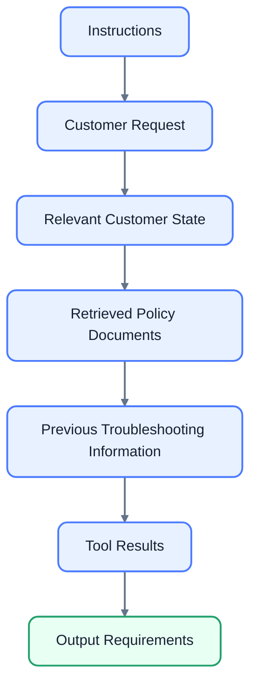

If the answer is poor, the first debugging question should not automatically be "What wording should we add?"

Instead, ask:

**Did the model have the right information and the right instructions?**

That question often saves substantial prompt complexity.

### More context is not automatically better

There is another trap here.

Suppose our support application responds to a billing question by putting the customer's entire account history, every product manual, all previous conversations, and dozens of policy documents into the context.

We have technically supplied more information.

We may also have made the system worse.

More context consumes tokens, can increase latency and cost, can introduce irrelevant or conflicting information, and can make the relevant evidence harder for the model to use. Earlier we saw the same problem with long contexts and lost-in-the-middle effects.

So context engineering is not "stuff as much information as possible into the prompt."

It is **information selection**.

The goal is to construct the smallest useful context that gives the model what it needs.

That leads naturally to retrieval.

## RAG vs. Memory: Similar Mechanism, Different Purpose

**RAG**, or **retrieval-augmented generation**, means retrieving relevant information from an external source and adding that information to the model's input before generating an answer.

The basic pattern is:

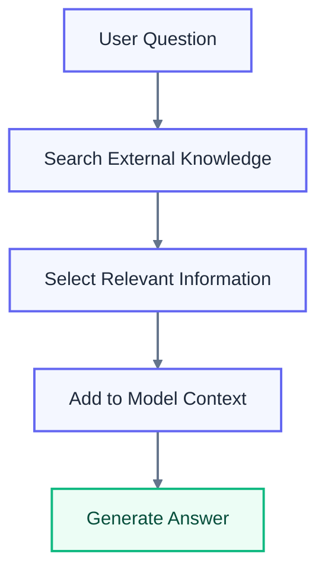

We already used RAG in the support application, but now we can place it correctly within the larger decision framework.

Suppose a customer asks:

> "What is the current refund policy for annual subscriptions?"

That answer belongs to the company's knowledge base. It may change next month.

Putting today's refund policy permanently into the prompt is a poor fit. Instead, retrieval can locate the current policy at request time. RAG is specifically useful when an application needs dynamic or private information without retraining the model.

Memory solves a somewhat different problem.

Suppose the customer previously told the support application:

> "I've already tried reinstalling the desktop application twice."

That is not necessarily general knowledge about the company. It is **state about this particular interaction or customer**.

Memory answers:

> "What information about this user or ongoing process should we preserve and retrieve later?"

RAG answers:

> "What external knowledge is relevant to this request?"

The underlying implementation can overlap. Both may use databases, embeddings, retrieval, or search. The conceptual purpose differs.

| Need                                          | Better fit              |
| --------------------------------------------- | ----------------------- |
| Tell the model how to behave                  | Prompt                  |
| Supply relevant information now               | Context engineering     |
| Find current company knowledge                | RAG                     |
| Preserve useful customer or task state        | Memory                  |
| Perform an external action                    | Tool calling            |
| Produce a reliable machine-readable structure | Structured output       |
| Learn a repeated behavior into the model      | Fine-tuning             |
| Perform exact calculation or authorization    | Deterministic code/tool |

These categories are not mutually exclusive.

Our support application could use all of them in one request:

```text
Prompt
  + retrieved refund policy
  + customer's stored preferences
  + current conversation
  + account lookup tool result
  + structured output schema
  ↓
Model
```

The engineering challenge is choosing the right combination without creating unnecessary complexity.

## Prompting vs. Fine-Tuning

**Fine-tuning** means taking a pretrained model and training it further on a task-specific dataset so that its learned parameters change.

This is fundamentally different from prompting.

With prompting:

```text
Model + instructions/examples/context
=> output
```

The underlying model remains unchanged.

With fine-tuning:

```text
Base model + training examples
=> specialized model
```

The model itself is modified.

That difference makes fine-tuning useful for problems that are fundamentally about **learned behavior**, rather than information that changes from request to request.

Imagine that our support application has 500,000 historical cases. Across those cases, we repeatedly need the model to classify requests into a fixed set of internal categories.

For example:

```text
billing
technical_problem
account_access
cancellation
product_question
```

If the task is stable, well-defined, and supported by a good training dataset, supervised fine-tuning may be worth investigating. Supervised fine-tuning trains on input-output examples so that the resulting model becomes better adapted to the target behavior.

But fine-tuning is a poor substitute for constantly changing knowledge.

Suppose the refund policy changes every week.

Training that changing policy into model parameters would be awkward and operationally expensive. Retrieval is a better mechanism for supplying current policy information.

A useful mental model is:

**Fine-tuning changes what the model has learned to do.**

**RAG changes what information the model can use right now.**

The two can also be combined. A model can be fine-tuned for a particular classification or response style while still using RAG to obtain current information.

### Fine-tuning is not simply "better prompting"

It is tempting to think of the techniques as a ladder:


where each later technique is automatically more advanced.

That is the wrong mental model.

They solve different problems.

A system might need only prompting.

Another might need prompting plus RAG.

Another might need prompting plus tools and memory.

Another might benefit from fine-tuning.

And a sophisticated system may use several simultaneously.

The choice should follow the failure mode, not the perceived sophistication of the technique.

## Model Choice and Model-Specific Prompt Engineering

There is one more intervention that engineers sometimes overlook:

**change the model.**

Suppose our support prompt has been carefully optimized, but the application still performs poorly on complex troubleshooting cases. Before building an elaborate prompt with dozens of special instructions, we should ask whether the selected model is capable enough for the task.

Conversely, suppose a small model handles simple ticket classification almost as well as a much larger model. Using the larger model for every request may increase cost and latency without providing meaningful quality improvement.

Model selection is therefore another optimization dimension:

```text
Quality
Cost
Latency
Context capacity
Tool capabilities
Structured-output support
Reasoning capability
Safety behavior
```

These properties vary between models and model generations.

More importantly, **prompt behavior is model-dependent**.

A prompt that works extremely well on one model may work less well on another. Models can differ in how strongly they follow instructions, how they interpret examples, how aggressively they use tools, how much context they need, and how they handle reasoning or output formatting.

This has an important consequence for production engineering.

A prompt should not be treated as an isolated portable artifact:

```text
prompt-v17
```

It is more accurately a tested configuration:

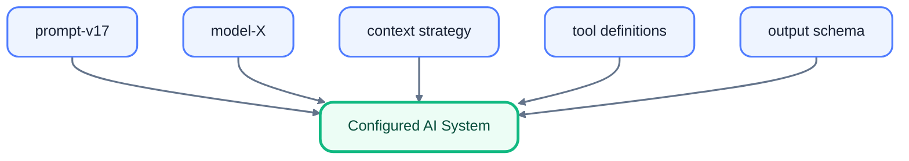

If we migrate the support application from model X to model Y, we should rerun the evaluation suite. Even if the prompt text remains unchanged, the system has changed.

This is exactly why the evaluation, versioning, and observability matter.

## A Practical Decision Framework

We can now turn the collection of techniques into a decision process.

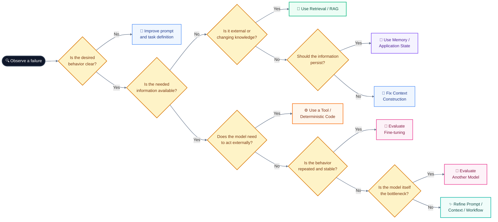

This is not a rigid algorithm. Several branches can apply at once.

For the support application:

- **Wrong tone:** improve the prompt or examples.
- **Missing current refund policy:** use retrieval.
- **Forgotten troubleshooting history:** use memory or application state.
- **Need current account balance:** use an authorized tool.
- **Need exact tax calculation:** use deterministic code rather than asking the model to calculate it.
- **Repeated classification task with abundant labeled examples:** evaluate fine-tuning.
- **Complex reasoning remains poor despite a sound workflow:** evaluate a stronger or better-suited model.

That last example is particularly important.

A language model should not be forced to imitate software that already exists.

If the application needs to determine whether a customer is entitled to a refund, and the rule can be expressed precisely in code, the safer architecture may be:

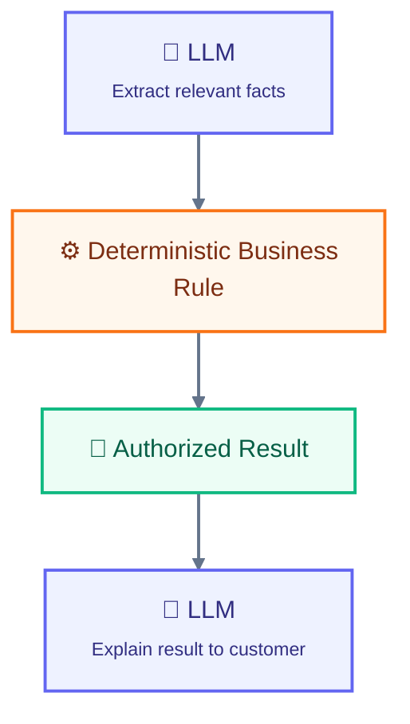

The model handles language. The program handles the rule.

This division of labor is often more reliable than trying to encode every business rule into prose instructions.

At this point, the evolution of our support application is visible as a sequence of architectural choices:

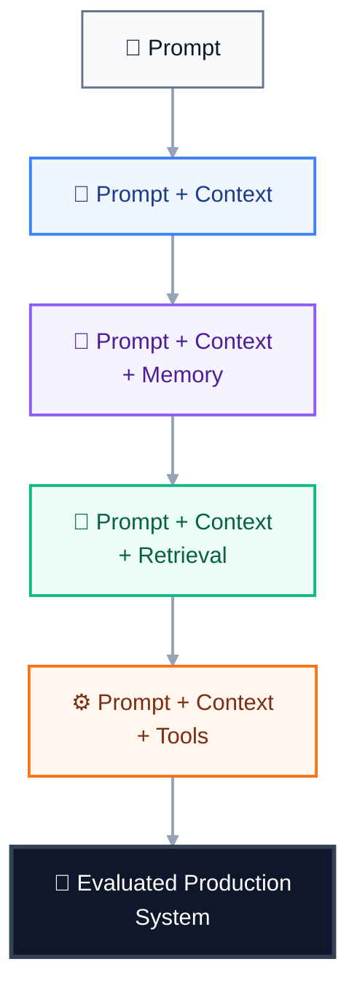

The prompt never disappeared. It simply stopped being the entire system.

That is the central lesson of mature prompt engineering: **the best prompt is often the one that lets the rest of the architecture do the work it is better suited to perform.**

If prompts, context, retrieval, memory, tools, models, and evaluations are all components of one system, then prompt engineering starts to resemble a broader discipline of system design. We can then ask what happens when parts of that design itself become programmable, automatically optimized, or generated by other models.

The interesting research question is what happens when we stop treating those components as manually assembled pieces and start treating them as something that can itself be programmed, optimized, and evaluated.

## Prompt Engineering Becomes System Design

Early prompt engineering often looked like this:

```text
Write a good instruction.
Try it.
Change the wording.
Try again.
```

That approach can work for small tasks, but it becomes fragile as systems grow.

Our support application might now have:

- a system instruction
- several reusable prompt templates
- few-shot examples
- a context-selection policy
- a retrieval pipeline
- customer memory
- multiple tools
- structured outputs
- safety checks
- evaluation datasets
- several model choices
- production telemetry

Changing one component can affect the others.

A retrieval change can alter the context the prompt sees. A model migration can change how examples are interpreted. A new tool can introduce new security risks. A longer context can change latency and answer quality. A prompt optimization that improves one evaluation set can hurt another.

This is why the most useful conceptual shift is:

**Prompt engineering is becoming a system-design discipline.**

The prompt remains important, but the object being engineered is increasingly the entire path from input to output.

The ReAct research direction illustrates this shift particularly well. Rather than treating reasoning and acting as isolated capabilities, ReAct combines reasoning-oriented behavior with actions that retrieve information or interact with an environment.

The same idea applies beyond agents. A production LLM application is increasingly a composition of model calls, context transformations, external computation, state, and evaluation.

### Modular prompts

One response to this complexity is **modularity**.

Instead of maintaining one enormous prompt containing every instruction for every situation, we can divide the application into components:

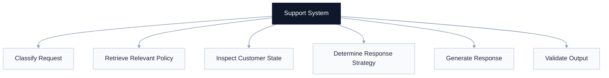

Each component has a narrower responsibility.

This has an important engineering advantage: a change becomes easier to reason about.

If the classification module changes, its evaluation can focus on classification. If the response-generation module changes, its own tests can run independently.

This resembles ordinary software decomposition. We do not normally build an entire application as one enormous function. The same principle can make LLM workflows easier to test and maintain.

But modularity has a cost. Every additional model call can introduce latency, token usage, failure modes, and another interface that must be maintained.

So modularity is useful when the separation gives us something valuable, such as independent evaluation, clearer responsibilities, better reliability, or a meaningful security boundary.

## Programmatic and Automated Prompting

Once prompts become components of a larger pipeline, manually editing strings is not the only option.

One research direction is **programmatic prompting**: representing the desired behavior as a structured program or declarative specification and allowing a system to determine how language-model calls should be configured.

DSPy is a prominent example. It represents language-model pipelines as computational graphs whose modules describe what a component should accomplish, rather than requiring developers to manually hard-code every final prompt. Its research goal is to make prompt and pipeline optimization more systematic.

The distinction is subtle but important.

Traditional approach:

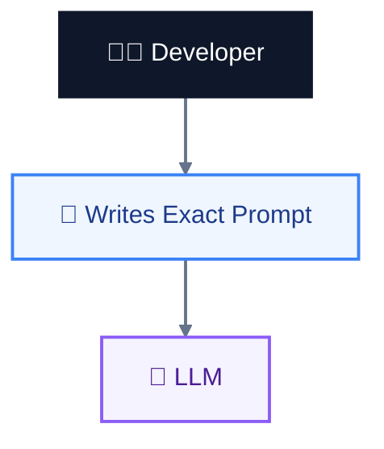

Programmatic approach:

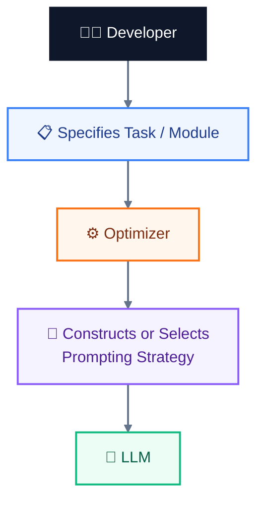

The developer is no longer necessarily specifying every sentence the model receives.

Instead, the developer specifies the **behavioral contract** and the evaluation criteria.

That creates a connection between prompting and software compilation.

A compiler takes a higher-level program and transforms it into a lower-level representation suitable for execution.

A programmatic prompting system can similarly take:

> "Classify the support request and produce a concise, evidence-grounded answer."

plus examples and an evaluation metric, then search for a configuration that performs well.

This is still an active research direction, not a universal replacement for manually designed prompts. Different tasks, models, datasets, and optimization methods can behave very differently.

## LLMs Optimizing Prompts

A more radical idea is to use one language model to improve prompts for another language-model call.

OPRO, or **Optimization by PROmpting**, is an example of this approach. Instead of using gradient-based optimization, OPRO describes the optimization problem in natural language and has an LLM generate candidate solutions based on previous candidates and their evaluated scores. The researchers applied this approach to prompt optimization and reported improvements over human-designed prompts on several benchmark tasks. [Open Review Research paper ](https://openreview.net/pdf?id=Bb4VGOWELI)

The basic loop looks like this:

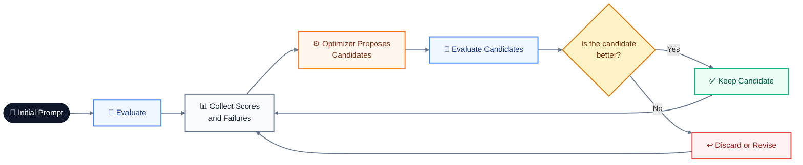

This sounds almost like replacing prompt engineering with another LLM.

But the difficult part has simply moved.

The optimizer needs a trustworthy objective.

If the evaluation says "more verbose is better," the optimizer may discover that verbosity is an easy way to increase its score.

If the evaluation rewards superficial fluency, the optimizer may produce polished but less accurate answers.

If the evaluation set is too small, optimization can overfit to those examples.

So automated prompt optimization does not eliminate evaluation. It makes **evaluation quality even more important**.

This connects directly to the optimization principles:

> The optimizer can only optimize what the evaluation system can measure.

That is why a representative evaluation set, held-out tests, safety cases, and regression tests remain essential even when an algorithm is generating the prompts.

## Eval-Driven Pipelines

This leads to a broader architecture:

```mermaid
flowchart LR
    A(["📋 Specification"])
    B["🧩 Prompt / Workflow<br/>Candidates"]
    C["🗂️ Evaluation Dataset"]
    D["📊 Scoring"]
    E["⚙️ Optimization"]
    F["🧪 Regression Tests"]
    G["🚀 Deployment"]
    H["📈 Production Observations"]
    I["📝 New Evaluation Cases"]

    A --> B
    B --> C
    C --> D
    D --> E
    E --> F
    F --> G
    G --> H
    H --> I
    I --> C

    classDef start fill:#0F172A,stroke:#0F172A,color:#FFFFFF,stroke-width:2px
    classDef design fill:#EFF6FF,stroke:#3B82F6,color:#1E3A8A,stroke-width:2px
    classDef eval fill:#F5F3FF,stroke:#8B5CF6,color:#4C1D95,stroke-width:2px
    classDef optimize fill:#FFF7ED,stroke:#F97316,color:#7C2D12,stroke-width:2px
    classDef test fill:#FEF3C7,stroke:#D97706,color:#78350F,stroke-width:2px
    classDef deploy fill:#ECFDF5,stroke:#10B981,color:#065F46,stroke-width:2px
    classDef observe fill:#F0FDFA,stroke:#14B8A6,color:#134E4A,stroke-width:2px

    class A start
    class B design
    class C,D eval
    class E optimize
    class F test
    class G deploy
    class H,I observe

    linkStyle default stroke:#64748B,stroke-width:1.8px
    linkStyle 8 stroke:#14B8A6,stroke-width:2px,stroke-dasharray:6 4

```

The evaluation dataset becomes more than a final exam.

It becomes the feedback signal driving development.

This resembles conventional machine-learning development, where a model is trained and then evaluated against data that was not used to optimize it. In LLM applications, the same principle is important for prompts and workflows: if the optimizer repeatedly sees exactly the same examples it is later judged on, it can learn those examples rather than the underlying task.

A mature pipeline therefore separates at least conceptually:

- **development examples**, used while designing
- **validation examples**, used to compare candidate configurations
- **held-out test cases**, reserved for final confirmation
- **regression cases**, added when production failures occur
- **adversarial and safety cases**, designed specifically to expose dangerous behavior

Large evaluation projects such as Stanford's HELM illustrate the broader principle: useful LLM evaluation is multidimensional rather than a single score. HELM evaluates models across many scenarios and metrics, with an emphasis on reproducibility and transparency.

For our support system, "better" therefore cannot simply mean:

```text
accuracy ↑
```

We might need:

```text
groundedness ↑
customer satisfaction ↑
unsupported claims ↓
unsafe actions ↓
latency ↓
cost ↓
```

And these objectives can conflict.

A prompt that produces more detailed answers may improve helpfulness while increasing cost and latency. A stricter refusal rule may reduce unsupported claims while frustrating users whose questions are actually answerable.

The engineering task is not to find the universally best prompt.

It is to find a configuration that satisfies the application's actual constraints.

## What We Still Do Not Know

Despite rapid progress, several important questions remain open.

### Can long context replace retrieval?

Models increasingly support very large context windows, but a large maximum context does not imply perfect use of that context.

The "Lost in the Middle" study found that language-model performance can degrade when relevant information is placed in the middle of long inputs, even for models designed to handle long contexts.

So the open question is not merely:

> "How many tokens can the model accept?"

It is:

> **"How reliably can the model find, weigh, and reason over the information it receives?"**

This is why retrieval and context selection remain relevant even as context windows grow.

### Can prompt injection ever be completely solved?

Probably not through prompting alone.

Prompt injection exploits the fact that models process natural-language instructions and data within the same computational mechanism. OWASP's guidance explicitly treats prompt injection as a continuing application-security problem and recommends layered controls such as privilege restriction, output validation, external-content separation, adversarial testing, and human approval for high-risk operations.

That leaves an architectural research problem:

**How can an LLM application safely combine flexible natural-language reasoning with strong security boundaries?**

This becomes even harder when memory persists across sessions or when agents share context. OWASP's recent guidance on context injection and over-sharing highlights the possibility that improperly scoped persistent context can allow information or malicious instructions to cross boundaries between users, agents, or workflows.

### Can models reliably judge other models?

**LLM-as-a-judge** means using one language model to evaluate another model's output.

It is attractive because human evaluation is expensive and difficult to scale.

But judges have biases. Research has found that LLM judges can favor certain answer characteristics or exhibit systematic biases, which means a high judge score is not automatically equivalent to high-quality output.

The practical consequence is important:

**An LLM judge should itself be evaluated.**

For our support system, we might combine:


rather than treating a single model-generated score as ground truth.

### Will optimized prompts transfer between models?

This remains another practical difficulty.

A prompt optimized against model A may depend on that model's instruction-following behavior, tokenization, training, tool-use conventions, or other characteristics.

Move to model B and the optimization target has changed.

That means portability is not a property we should assume. It is something we should test.

A prompt that is robust across several models is more portable than one that only works on the exact model used during optimization.

### Can automated optimization generalize?

An optimizer can find a configuration that performs extremely well on its evaluation data.

That does not prove it has learned the intended task.

The danger is the same one encountered throughout machine learning: **overfitting**.

If our support optimizer discovers a bizarre instruction that improves performance on 500 evaluation examples but fails on real customer requests, we have optimized the benchmark rather than the application.

This is why held-out tests, adversarial examples, and production monitoring remain necessary.

## The Bigger Picture

We began with a prompt.

Something like:

```text
You are a customer-support assistant.
Answer the customer's question using the supplied information.
```

It seemed like the central object.

Now, the architecture looks very different:

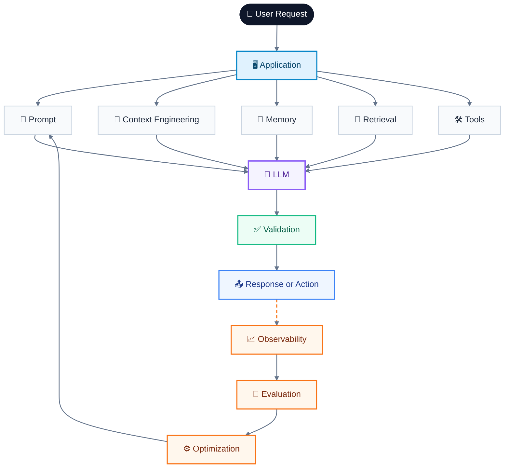

The prompt is still there.

It is simply no longer alone.

That is the trajectory of prompt engineering as a field:


Each step moves responsibility away from clever wording and toward explicit system design.

Prompt engineering remains valuable because instructions still influence model behavior. But the mature engineer asks a larger set of questions:

- Is the task specified clearly?
- Does the model have the information it needs?
- Should that information come from retrieval or memory?
- Should an external tool perform the operation instead?
- Is the output structured and validated?
- Can untrusted content influence privileged actions?
- How will we evaluate the behavior?
- How will we know when a change made it better?
- Can we reproduce which configuration produced an answer?
- Can we roll it back?
- What happens when the model changes?
- Which part of the system should own this responsibility?

That is the real destination of prompt engineering.

Not a collection of magic phrases.

Not a hunt for one perfect prompt.

**A disciplined way of designing, testing, securing, and improving systems that use language models.**

And that distinction matters because the most reliable LLM applications are rarely the ones with the cleverest prompts. They are the ones that give the model appropriate instructions, appropriate information, appropriate tools, appropriate constraints, and a surrounding software system that does not ask the model to be responsible for things software can do more reliably.
